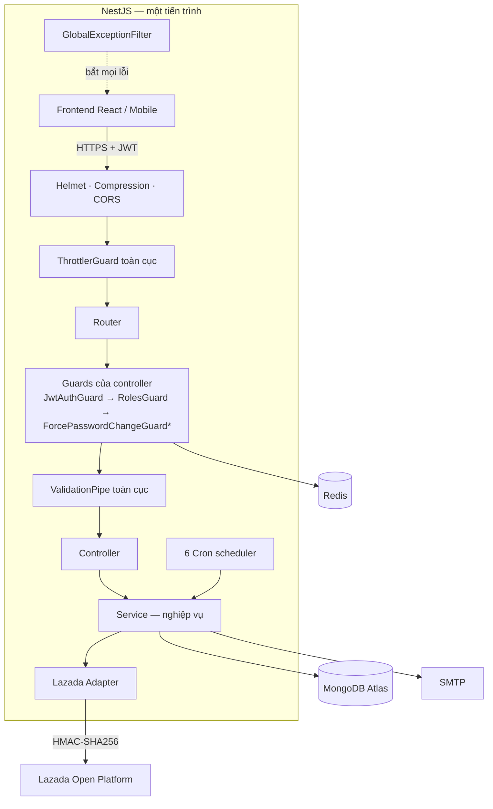
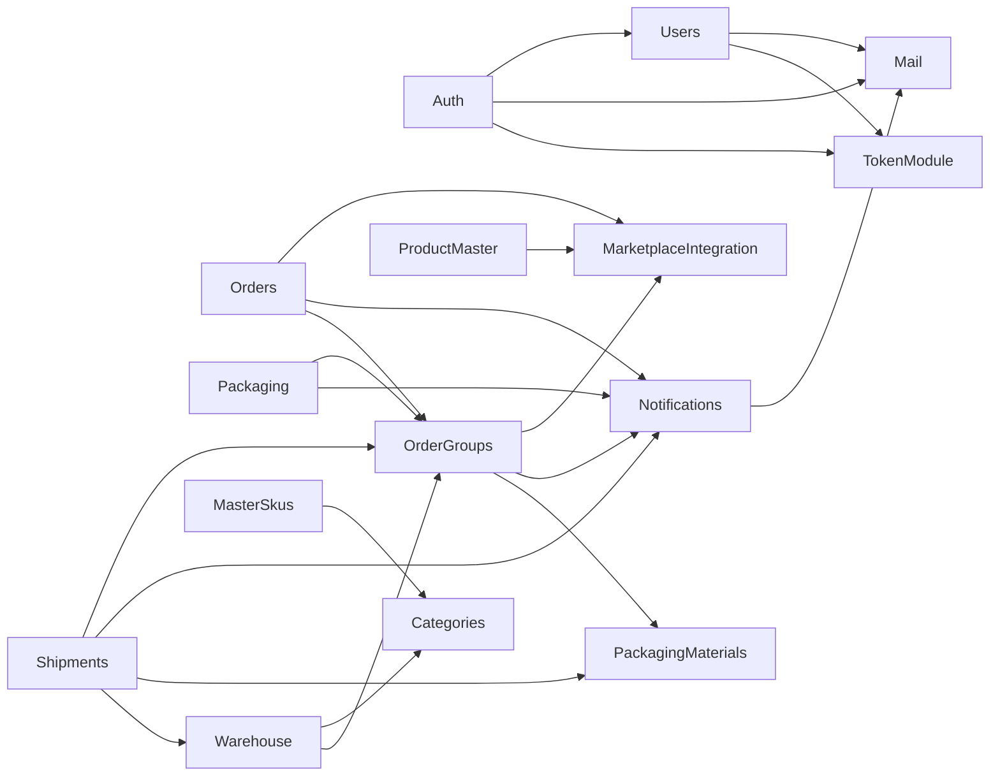

# 01 — Công nghệ và kiến trúc Backend

## 1. Tổng quan

Backend OptiPackAI là một ứng dụng **NestJS** viết bằng **TypeScript**, lưu dữ liệu trên **MongoDB Atlas**, dùng **Redis** làm bộ nhớ đệm. Kiến trúc là **modular monolith**: một tiến trình duy nhất, chia thành 14 module có ranh giới rõ ràng. Hệ thống tích hợp **Lazada Open Platform** qua lớp adapter và chạy 6 tác vụ định kỳ (cron).

| Chỉ số | Giá trị |
|---|---|
| Số file nguồn (`src/`, `scripts/`, `test/`) | 251 |
| Tổng số dòng mã | ~24.800 |
| Module | 14 (+ `common`, `config`) |
| Endpoint REST | 141 (18 controller) |
| Collection MongoDB | 28 đang dùng (+1 khai báo chưa dùng) |
| Tác vụ định kỳ (cron) | 6 |
| Unit test | 39 suite / 350 test |
| Mã đối chiếu | `main` `93d20bf` + nhánh `feature/viet_befe` + bản sửa ObjectId 07/10/2026 |

## 2. Công nghệ sử dụng và vai trò

### 2.1. Nền tảng

| Công nghệ | Phiên bản | Dùng để làm gì | Ý nghĩa khi dùng |
|---|---|---|---|
| **Node.js** | ≥ 20 | Môi trường chạy JavaScript phía server | Xử lý bất đồng bộ (I/O không chặn) phù hợp hệ thống gọi nhiều API ngoài và DB |
| **TypeScript** | 5.7 | Ngôn ngữ lập trình | Bắt lỗi kiểu dữ liệu lúc biên dịch; chạy chế độ `strict` nên mọi giá trị `null`/`undefined` phải được xử lý rõ |
| **NestJS** | 11 | Framework backend | Tổ chức mã theo Module–Controller–Service, có Dependency Injection, Guard, Pipe, Filter dựng sẵn — giúp nhóm nhiều người viết mã đồng nhất |
| **Express** | 5 | HTTP server bên dưới NestJS | Nền tảng xử lý request/response |

### 2.2. Dữ liệu

| Công nghệ | Phiên bản | Dùng để làm gì | Ý nghĩa khi dùng |
|---|---|---|---|
| **MongoDB Atlas** | — | CSDL chính | Lưu tài liệu JSON linh hoạt (đơn hàng sàn có cấu trúc lồng nhau); Atlas là **replica set** nên hỗ trợ **transaction nhiều document** — bắt buộc cho các thao tác trừ tồn, đóng gói |
| **Mongoose** + `@nestjs/mongoose` | 9 / 11 | ODM: khai báo schema, index, truy vấn | Có schema và kiểm kiểu cho CSDL vốn không có schema; tự tạo index; hỗ trợ session/transaction. ⚠️ Trường id phải khai `type: SchemaTypes.ObjectId`; khai `type: Types.ObjectId` bị `@nestjs/mongoose` dựng thành kiểu Mixed và Mongoose không đổi chuỗi id sang ObjectId (lỗi thật, đã sửa 07/10/2026 — xem 05 mục 1b) |
| **Redis** + **ioredis** | 6 | Bộ nhớ đệm | Cache trạng thái xác thực người dùng 60 giây → JwtStrategy không phải đọc DB ở mỗi request |

### 2.3. Bảo mật và xác thực

| Công nghệ | Dùng để làm gì | Ý nghĩa khi dùng |
|---|---|---|
| **Passport** + **passport-jwt** + `@nestjs/jwt` | Xác thực bằng JWT (HS256) | Mỗi request mang access token; BE không cần lưu phiên |
| **bcrypt** | Băm mật khẩu (cost 12) và mã dự phòng MFA (cost 10) | Mật khẩu không bao giờ lưu dạng rõ; chống dò ngược |
| **crypto (Node)** | SHA-256 cho token; AES-256-GCM cho token sàn | Token lưu trong DB vô dụng nếu bị lộ DB |
| **otplib** | Sinh và kiểm mã TOTP 6 số cho MFA | Đăng nhập 2 lớp bằng ứng dụng Authenticator |
| **Helmet** | Thêm header bảo mật HTTP | Chống một số tấn công trình duyệt (clickjacking, sniffing…) |
| **@nestjs/throttler** | Giới hạn 20 request / 60 giây / IP | Chống dò mật khẩu và spam API |
| **class-validator** + **class-transformer** | Kiểm tra và chuyển kiểu dữ liệu đầu vào | Chặn dữ liệu sai trước khi vào nghiệp vụ; `forbidNonWhitelisted` từ chối trường lạ |

### 2.4. Tích hợp và tiện ích

| Công nghệ | Dùng để làm gì | Ý nghĩa khi dùng |
|---|---|---|
| **axios** | Gọi HTTP tới Lazada, Google | Client HTTP có timeout, dễ bắt lỗi |
| **@nestjs/schedule** | Tác vụ định kỳ (cron) | Đồng bộ đơn, quét quá hạn, đồng bộ sản phẩm chạy tự động |
| **Nodemailer** | Gửi email SMTP | Gửi mật khẩu tạm, quên mật khẩu, thông báo khẩn |
| **@nestjs/swagger** | Sinh tài liệu API tại `/api/docs` | FE tra cứu và thử API trực tiếp |
| **compression** | Nén gzip response | Giảm dung lượng truyền tải |
| **@nestjs/config** | Đọc `.env`, chia namespace cấu hình | Tách cấu hình khỏi mã nguồn |

### 2.5. Chất lượng mã và công cụ

| Công cụ | Vai trò |
|---|---|
| **Jest** + **ts-jest** | Kiểm thử đơn vị (39 suite) và e2e (`test/`) |
| **ESLint** (`typescript-eslint` chế độ type-checked) + **Prettier** | Quy tắc mã nghiêm ngặt và định dạng thống nhất |
| **Husky** + **Commitlint** | Chạy test trước mỗi commit; ép định dạng commit `type(AOFP-<số>): ...` |
| **Docker** / **Dockerfile** | Đóng gói và chạy dịch vụ phụ trợ |
| **ngrok** | Đường hầm HTTPS cho callback OAuth Lazada khi chạy local |

## 3. Kiến trúc tổng thể

\* `ForcePasswordChangeGuard` chỉ đang gắn ở `UsersController` — xem tài liệu 03 và 07.

## 4. Vòng đời một request

1. **Middleware** (`main.ts`): Helmet thêm header bảo mật → compression → CORS kiểm tra nguồn gọi.
2. **ThrottlerGuard** (toàn cục, `app.module.ts`): đếm request theo IP, vượt 20/60 giây → 429.
3. **Guard của controller** (khai bằng `@UseGuards`):
   - `JwtAuthGuard` → `JwtStrategy.validate()`: kiểm chữ ký và hạn token; đọc trạng thái người dùng từ Redis (hết cache thì đọc DB rồi cache 60 giây); chặn tài khoản bị vô hiệu hóa, vai trò sai, quá hạn đổi mật khẩu 72 giờ; gắn `request.user`.
   - `RolesGuard`: so `request.user.role` với `@Roles(...)` của route.
   - `ForcePasswordChangeGuard` (chỉ Users): chặn nếu bắt buộc đổi mật khẩu.
4. **ValidationPipe**: chuyển kiểu, kiểm tra DTO, loại/ từ chối trường lạ.
5. **Controller** gọi **Service**; service đọc/ghi MongoDB (có transaction khi cần) và gọi adapter sàn.
6. Mọi lỗi ném ra được **GlobalExceptionFilter** chuẩn hóa thành `{ success:false, error_code, message, details, timestamp, path }`.

## 5. Quan hệ phụ thuộc giữa các module

Không có vòng phụ thuộc. Ngoài phụ thuộc qua service như sơ đồ, **nhiều module đăng ký trực tiếp schema của module khác** để đọc/ghi thẳng collection (ví dụ `shipments` đăng ký `Order`, `OrderGroup`, `InventoryMovement`, `ProductMaster`; `master-skus` đăng ký `SkuBinAssignment`, `InventoryMovement`, `ProductMaster`). Cách này nhanh nhưng làm nghiệp vụ của một collection nằm rải ở nhiều nơi — đánh giá ở tài liệu 07.

## 6. Tác vụ định kỳ

| Tác vụ | Lịch | File | Việc làm |
|---|---|---|---|
| Đồng bộ đơn Lazada | 5 phút/lần | `orders/lazada-order-sync.scheduler.ts` | Kéo đơn mới/thay đổi của mọi shop đang kết nối, gộp nhóm |
| Lưới an toàn tạo nhóm đơn | 5 phút/lần | `order-groups/order-group-backfill.scheduler.ts` | Tạo nhóm cho đơn lỡ chưa có nhóm |
| Hạn đóng gói đơn hỏa tốc | 10 phút/lần | `order-groups/express-order-sla.scheduler.ts` | Gắn cờ quá hạn, gửi thông báo |
| Quá hạn giao hàng | 15 phút/lần | `shipments/shipment-sla.scheduler.ts` | Gắn cờ vận đơn quá hạn, gửi thông báo critical |
| Đồng bộ Product Master (tăng dần) | Mỗi giờ (phút 0) | `product-master/product-master-sync.scheduler.ts` | Lấy sản phẩm Lazada thay đổi từ mốc `last_product_synced_at` của từng shop |
| Đồng bộ Product Master (toàn bộ) | 3:00 hằng ngày | `product-master/product-master-sync.scheduler.ts` | Lấy lại toàn bộ danh sách sản phẩm của mọi shop |
| Làm mới token sàn | Khi cần (trước mỗi lần gọi API) | `marketplace-integration.service.ts` | Tự refresh token sắp hết hạn |

`ScheduleModule.forRoot()` chỉ được đăng ký **một lần** ở `app.module.ts`; module con chỉ cần dùng `@Cron()`.

## 7. Cấu hình (biến môi trường)

| Nhóm | Biến | Ghi chú |
|---|---|---|
| Ứng dụng | `PORT`, `CORS_ORIGIN`, `FRONTEND_URL`, `CLIENT_REDIRECT_CALLBACK`, `CLIENT_MARKETPLACE_REDIRECT_CALLBACK` | `CORS_ORIGIN` để trống = cho phép mọi nguồn (xem 07) |
| CSDL | `MONGODB_URI` | Phải là replica set (Atlas) để transaction chạy |
| Redis | `REDIS_HOST`, `REDIS_PORT`, `REDIS_PASSWORD` | |
| JWT | `JWT_ACCESS_SECRET`, `JWT_REFRESH_SECRET`, `JWT_EXPIRES_IN` (mặc định 86400 giây), `JWT_REFRESH_EXPIRES_IN` (mặc định 2.592.000 giây) | |
| Google | `GOOGLE_CLIENT_ID`, `GOOGLE_CLIENT_SECRET`, `GOOGLE_REDIRECT_URI` | |
| Email | `MAIL_HOST`, `MAIL_PORT`, `MAIL_SECURE`, `MAIL_USER`, `MAIL_PASSWORD`, `MAIL_FROM_NAME`, `MAIL_FROM_ADDRESS` | |
| Mã hóa | `TOKEN_ENCRYPTION_KEY` | Khóa AES cho token sàn — đổi khóa thì token đã lưu không giải mã được |
| Lazada | `LAZADA_APP_KEY`, `LAZADA_APP_SECRET`, `LAZADA_REDIRECT_URI`, `LAZADA_SANDBOX`, `LAZADA_API_BASE_URL`, `LAZADA_WRITE_APIS_ENABLED`, `LAZADA_SHIPPING_ALLOCATE_TYPE` | 2 biến cuối chưa có trong `.env.example` của bản `be.zip` này |
| Giao hàng | `SHIPMENT_MIN_RETRY_GAP_MINUTES` (120), `SHIPMENT_DUE_BUSINESS_HOURS` (40) | |
| Seed | `SEED_ADMIN_EMAIL`, `SEED_ADMIN_PASSWORD` | Chỉ dùng cho `npm run seed:admin` |
| TikTok, Tiki | `TIKTOK_*`, `TIKI_*` | Còn trong `.env.example` nhưng adapter không được đăng ký — thừa |
