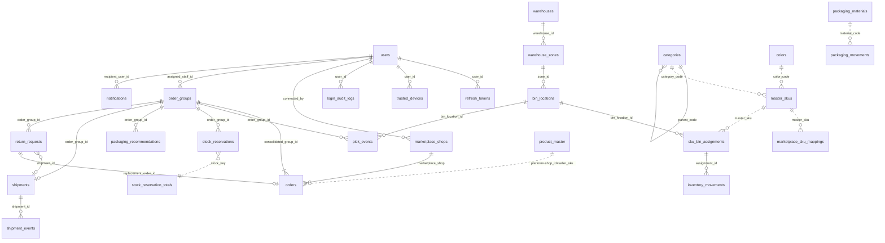

# 05 — Thiết kế cơ sở dữ liệu

> Sinh từ `*.schema.ts` (Mongoose) và đối chiếu thủ công. CSDL: **MongoDB Atlas** (replica set — bắt buộc cho transaction). ODM: **Mongoose 9** qua `@nestjs/mongoose`.

## 1. Cách CSDL được tạo

- **Không có migration tạo bảng.** MongoDB tạo collection **tự động** ở lần ghi đầu tiên. Tên collection khai báo trong `@Schema({ collection: ... })`.
- **Index** được Mongoose tạo tự động khi ứng dụng khởi động (`autoIndex` mặc định bật) từ `@Prop({ index/unique })` và `XxxSchema.index(...)`.
- **Timestamps**: hầu hết schema bật `timestamps` và đổi tên thành `created_at`/`updated_at` (snake_case).
- **Khóa phiên bản**: trường `__v` của Mongoose được dùng làm `version` cho khóa lạc quan (các thao tác ghi gửi `expected_version`).
- **Script dữ liệu** (`be/scripts/`): `seed-admin` tạo Admin đầu tiên; các `migrate-*`/`backfill-*` sửa dữ liệu cũ khi đổi thiết kế, chạy 1 lần mỗi môi trường, chạy lại an toàn.
- **Transaction** (`session.withTransaction`) dùng cho các thao tác nhiều collection: lấy hàng, đóng gói + trừ vật liệu, duyệt gợi ý, nhập/kiểm/chuyển tồn, kiểm hàng hoàn.

### 1b. Kiểu dữ liệu của các trường id — 🔄 ĐÃ SỬA 07/10/2026

- 35 trường id tham chiếu (ngoài `_id`) trên 18 collection khai `@Prop({ type: SchemaTypes.ObjectId })`. Danh sách đầy đủ: `src/common/schemas/objectid-fields.ts` (`OBJECT_ID_FIELDS`).
- **Trước 07/10/2026** các trường này khai `type: Types.ObjectId`. Với `@nestjs/mongoose`, cách khai đó tạo ra kiểu **Mixed**: Mongoose không đổi chuỗi sang ObjectId khi truy vấn và lưu nguyên giá trị khi ghi. Hậu quả đã gặp: Picking List "CHƯA GÁN VỊ TRÍ", quét hàng 409, nhập thêm hàng 404 (truy vấn bằng chuỗi id kho); `pick_events.order_group_id`, `notifications.recipient_user_id`/`related_entity_id`, `login_audit_logs.user_id` bị lưu dạng chuỗi.
- **Dữ liệu cũ:** chạy `scripts/migrate-objectid-fields.ts` (chạy thử mặc định, `--apply` để ghi) 1 lần trên mỗi database để đổi các giá trị chuỗi còn sót sang ObjectId. Không chạy thì các bản ghi đó không khớp truy vấn (ví dụ thông báo cũ không hiện cho người nhận).
- **Bảo vệ:** test `src/common/schemas/objectid-fields.spec.ts` quét mọi schema, báo lỗi nếu có trường Mixed hoặc danh sách lệch thực tế. Quy tắc ghi trong `CLAUDE.md` (Database Design Standards, mục 24).

## 2. Tổng quan 29 collection

| Collection | Module | Vai trò | Lưu giữ |
|---|---|---|---|
| `processed_webhook_events` | common | Chống xử lý trùng sự kiện webhook. | **Không được đăng ký ở module nào → collection không được tạo** (xem 07) |
| `login_audit_logs` | auth | Nhật ký mọi lần đăng nhập. | Tự xóa sau 60 ngày (TTL) |
| `refresh_tokens` | auth | Refresh token đang hiệu lực, phục vụ xoay vòng token và phát hiện đánh cắp. | Tự xóa khi hết hạn (TTL theo `exp`) |
| `trusted_devices` | auth | Thiết bị đã qua MFA, được bỏ qua MFA trong 30 ngày. | Tự xóa khi hết hạn (TTL) |
| `categories` | categories | Danh mục sản phẩm 2 cấp. | Vĩnh viễn |
| `marketplace_oauth_states` | marketplace-integration | Trạng thái tạm của luồng OAuth kết nối shop. | Tự xóa sau 10 phút (TTL) |
| `marketplace_shops` | marketplace-integration | Shop đã kết nối và token gọi API sàn (đã mã hóa). | Vĩnh viễn |
| `colors` | master-skus | Danh mục màu chuẩn. | Vĩnh viễn |
| `marketplace_sku_mappings` | master-skus | Nối SKU sàn → SKU nội bộ. | Vĩnh viễn |
| `master_skus` | master-skus | SKU nội bộ — 1 sản phẩm thật. | Vĩnh viễn |
| `notifications` | notifications | Thông báo trong ứng dụng. | Vĩnh viễn |
| `order_groups` | order-groups | Nhóm đơn — đơn vị công việc của kho (1 thùng, 1 lần giao). | Vĩnh viễn |
| `pick_events` | order-groups | Nhật ký từng lần quét lấy hàng. | Vĩnh viễn |
| `stock_reservations` | order-groups | Dòng giữ chỗ tồn của từng SKU trong từng nhóm đơn. | Vĩnh viễn (chuyển released) |
| `stock_reservation_totals` | order-groups | Bộ đếm tổng giữ chỗ theo khóa tồn. | Vĩnh viễn |
| `orders` | orders | Đơn hàng đồng bộ từ sàn (và đơn đổi hàng do hệ thống tạo). | Vĩnh viễn |
| `packaging_materials` | packaging-materials | Danh mục vật liệu đóng gói và tồn hiện tại. | Vĩnh viễn |
| `packaging_movements` | packaging-materials | Sổ cái biến động vật liệu. | Vĩnh viễn (chỉ thêm) |
| `packaging_recommendations` | packaging | Gợi ý đóng gói và quyết định duyệt. | Vĩnh viễn (bản cũ is_active=false) |
| `product_master` | product-master | Kích thước/cân đóng gói của từng SKU sàn. | Vĩnh viễn |
| `return_requests` | shipments | Phiếu trả hàng / đổi hàng (RMA). | Vĩnh viễn |
| `shipment_events` | shipments | Lịch sử từng bước của vận đơn. | Vĩnh viễn (chỉ thêm) |
| `shipments` | shipments | Vận đơn tự giao. | Vĩnh viễn |
| `users` | users | Tài khoản nhân viên nội bộ và trạng thái bảo mật của từng tài khoản. | Vĩnh viễn (xóa mềm) |
| `bin_locations` | warehouse | Ô chứa hàng (vị trí). | Vĩnh viễn |
| `inventory_movements` | warehouse | Sổ cái biến động tồn kho (bất biến). | Vĩnh viễn (chỉ thêm) |
| `sku_bin_assignments` | warehouse | Tồn của một SKU tại một ô. | Vĩnh viễn |
| `warehouse_zones` | warehouse | Khu trong kho. | Vĩnh viễn |
| `warehouses` | warehouse | Kho vật lý. | Vĩnh viễn |

## 3. Sơ đồ quan hệ (ERD)

Đường liền: tham chiếu bằng `ObjectId`. Đường nét đứt: liên kết logic bằng mã/chuỗi (không có ràng buộc ở CSDL).

### Khóa liên kết logic dùng xuyên suốt

| Khóa | Ý nghĩa | Collection dùng |
|---|---|---|
| `platform` + `shop_id` + `seller_sku` | Định danh 1 SKU trên 1 shop sàn | orders.items, product_master, sku_bin_assignments, stock_reservations, marketplace_sku_mappings, inventory_movements, pick_events |
| `master_sku` | SKU nội bộ (gộp tồn nhiều sàn) | master_skus, marketplace_sku_mappings, sku_bin_assignments, inventory_movements, stock_reservations |
| `stock_key` | `master_sku` nếu đã nối, ngược lại `platform:shop_id:seller_sku` | stock_reservations, stock_reservation_totals |
| `consolidation_key` | SHA-256 thông tin người nhận chuẩn hóa | orders (gộp đơn) |
| `actor_id` / `created_by` / `decided_by`… (chuỗi) | ID người dùng lưu dạng **chuỗi** (khai `String` có chủ đích, có thể là `"system"`), không phải ObjectId | inventory_movements, packaging_movements, shipment_events, return_requests, master_skus… |

## 4. Chi tiết từng collection

Ký hiệu: **R** bắt buộc · **U** duy nhất · **I** có index đơn trường.

### `processed_webhook_events` — `ProcessedWebhookEvent`

- **File:** `src/common/schemas/processed-webhook-event.schema.ts`
- **Vai trò:** Chống xử lý trùng sự kiện webhook.
- **Theo dõi được:** —
- **Lưu giữ:** **Không được đăng ký ở module nào → collection không được tạo** (xem 07)
- **Timestamps:** created_at

| Trường | Kiểu | R/U/I | Mặc định | Tham chiếu | Ý nghĩa |
|---|---|---|---|---|---|
| `_id` | ObjectId | R U | tự sinh | | Khóa chính |
| `platform` | `MarketplacePlatform` | R |  |  | Sàn |
| `event_id` | `string` | R |  |  | ID sự kiện webhook (chống xử lý trùng) |

**Index ghép / đặc biệt:**

- `{ platform: 1, event_id: 1 }` — `{ unique: true }`
- `{ created_at: 1 }` — `{ expireAfterSeconds: 7 * 24 * 60 * 60 }`

### `login_audit_logs` — `LoginAuditLog`

- **File:** `src/modules/auth/schemas/login-audit-log.schema.ts`
- **Vai trò:** Nhật ký mọi lần đăng nhập.
- **Theo dõi được:** Ai đăng nhập lúc nào, từ đâu, thành công hay lý do thất bại — phục vụ điều tra.
- **Lưu giữ:** Tự xóa sau 60 ngày (TTL)
- **Timestamps:** created_at

| Trường | Kiểu | R/U/I | Mặc định | Tham chiếu | Ý nghĩa |
|---|---|---|---|---|---|
| `_id` | ObjectId | R U | tự sinh | | Khóa chính |
| `user_id` | `ObjectId` |  |  | User | Người dùng (null nếu email không tồn tại) |
| `email_attempted` | `string` | R |  |  | Email đã nhập |
| `success` | `boolean` | R |  |  | Đăng nhập thành công hay không |
| `failure_reason` | `string` |  |  |  | Lý do thất bại |
| `ip_address` | `string` |  |  |  | IP |
| `user_agent` | `string` |  |  |  | Trình duyệt |

**Index ghép / đặc biệt:**

- `{ user_id: 1, created_at: -1 }`
- `{ created_at: 1 }` — `{ expireAfterSeconds: 60 * 60 * 24 * 60 }`

### `refresh_tokens` — `RefreshToken`

- **File:** `src/modules/auth/schemas/refresh-token.schema.ts`
- **Vai trò:** Refresh token đang hiệu lực, phục vụ xoay vòng token và phát hiện đánh cắp.
- **Theo dõi được:** Phiên đăng nhập của từng người: cấp lúc nào, từ IP/trình duyệt nào, đã thu hồi chưa.
- **Lưu giữ:** Tự xóa khi hết hạn (TTL theo `exp`)
- **Timestamps:** created_at, updated_at

| Trường | Kiểu | R/U/I | Mặc định | Tham chiếu | Ý nghĩa |
|---|---|---|---|---|---|
| `_id` | ObjectId | R U | tự sinh | | Khóa chính |
| `token_hash` | `string` | R |  |  | SHA-256 của refresh token (không lưu token gốc) |
| `user_id` | `ObjectId` | R |  | User | Chủ token |
| `iat` | `Date` | R |  |  | Thời điểm cấp |
| `exp` | `Date` | R |  |  | Hạn dùng (TTL tự xóa khi hết hạn) |
| `user_role` | `UserRole` | R |  |  | Vai trò lúc cấp |
| `is_revoked` | `boolean` |  | false  |  | Đã bị thu hồi (dùng lại → thu hồi toàn bộ phiên) |
| `ip_address` | `string` |  |  |  | IP lúc cấp |
| `user_agent` | `string` |  |  |  | Trình duyệt lúc cấp |

**Index ghép / đặc biệt:**

- `{ token_hash: 1 }` — `{ unique: true }`
- `{ user_id: 1 }`
- `{ exp: 1 }` — `{ expireAfterSeconds: 0 }`

### `trusted_devices` — `TrustedDevice`

- **File:** `src/modules/auth/schemas/trusted-device.schema.ts`
- **Vai trò:** Thiết bị đã qua MFA, được bỏ qua MFA trong 30 ngày.
- **Theo dõi được:** Thiết bị tin cậy của từng người.
- **Lưu giữ:** Tự xóa khi hết hạn (TTL)
- **Timestamps:** created_at

| Trường | Kiểu | R/U/I | Mặc định | Tham chiếu | Ý nghĩa |
|---|---|---|---|---|---|
| `_id` | ObjectId | R U | tự sinh | | Khóa chính |
| `user_id` | `ObjectId` | R |  | User | Chủ thiết bị |
| `token_hash` | `string` | R |  |  | SHA-256 của trusted_device_token |
| `user_agent` | `string` |  |  |  | Trình duyệt |
| `expires_at` | `Date` | R |  |  | Hạn tin cậy 30 ngày (TTL) |

**Index ghép / đặc biệt:**

- `{ token_hash: 1 }` — `{ unique: true }`
- `{ user_id: 1 }`
- `{ expires_at: 1 }` — `{ expireAfterSeconds: 0 }`

### `categories` — `Category`

- **File:** `src/modules/categories/schemas/category.schema.ts`
- **Vai trò:** Danh mục sản phẩm 2 cấp.
- **Theo dõi được:** Cây danh mục, thang size.
- **Lưu giữ:** Vĩnh viễn
- **Timestamps:** created_at, updated_at

| Trường | Kiểu | R/U/I | Mặc định | Tham chiếu | Ý nghĩa |
|---|---|---|---|---|---|
| `_id` | ObjectId | R U | tự sinh | | Khóa chính |
| `code` | `string` | R U |  |  | Mã danh mục |
| `name` | `string` | R |  |  | Tên |
| `parent_code` | `string \| null` | I | null |  | Danh mục cha (null = cấp 1) |
| `level` | `1 \| 2` | R |  |  | 1 hoặc 2 |
| `size_scale` | `string[]` |  | []  |  | Thang size (chỉ cấp 2) |
| `is_active` | `boolean` |  | true  |  | Cờ hoạt động |

### `marketplace_oauth_states` — `MarketplaceOauthState`

- **File:** `src/modules/marketplace-integration/schemas/marketplace-oauth-state.schema.ts`
- **Vai trò:** Trạng thái tạm của luồng OAuth kết nối shop.
- **Theo dõi được:** Phiên kết nối shop đang dở.
- **Lưu giữ:** Tự xóa sau 10 phút (TTL)
- **Timestamps:** created_at

| Trường | Kiểu | R/U/I | Mặc định | Tham chiếu | Ý nghĩa |
|---|---|---|---|---|---|
| `_id` | ObjectId | R U | tự sinh | | Khóa chính |
| `state` | `string` | R U |  |  | Chuỗi ngẫu nhiên chống giả mạo OAuth, dùng 1 lần |
| `admin_user_id` | `string` | R |  |  | Admin bắt đầu kết nối |
| `platform` | `MarketplacePlatform` | R |  |  | Sàn |

**Index ghép / đặc biệt:**

- `{ created_at: 1 }` — `{ expireAfterSeconds: 600 }`

### `marketplace_shops` — `MarketplaceShop`

- **File:** `src/modules/marketplace-integration/schemas/marketplace-shop.schema.ts`
- **Vai trò:** Shop đã kết nối và token gọi API sàn (đã mã hóa).
- **Theo dõi được:** Shop nào đã kết nối, ai kết nối, hạn token, lần đồng bộ cuối.
- **Lưu giữ:** Vĩnh viễn
- **Timestamps:** created_at, updated_at

| Trường | Kiểu | R/U/I | Mặc định | Tham chiếu | Ý nghĩa |
|---|---|---|---|---|---|
| `_id` | ObjectId | R U | tự sinh | | Khóa chính |
| `platform` | `MarketplacePlatform` | R |  |  | Sàn (lazada…) |
| `shop_id` | `string` | R |  |  | ID shop/seller trên sàn |
| `shop_name` | `string \| null` |  | null  |  | Tên shop |
| `shop_cipher` | `string \| null` |  | null  |  | Mã phụ của TikTok (không dùng với Lazada) |
| `environment` | `'sandbox' \| 'production'` | R | 'sandbox'  |  | sandbox/production |
| `access_token_encrypted` | `string` | R |  |  | Access token sàn mã hóa AES-256-GCM |
| `refresh_token_encrypted` | `string` | R |  |  | Refresh token sàn mã hóa |
| `access_token_expires_at` | `Date` | R |  |  | Hạn access token sàn |
| `refresh_token_expires_at` | `Date` | R |  |  | Hạn refresh token sàn |
| `last_polled_at` | `Date \| null` |  | null  |  | Lần đồng bộ đơn gần nhất (mốc cho lần sau) |
| `last_product_synced_at` | `Date \| null` |  | null  |  | 🆕 04/10/2026 — Mốc đồng bộ danh sách sản phẩm gần nhất (lần sau lấy sản phẩm thay đổi từ mốc này trừ 10 phút; null = lần sau lấy toàn bộ). Chỉ ghi khi quét hết danh sách |
| `connected_by` | `ObjectId` | R |  | User | Admin đã kết nối |
| `is_active` | `boolean` |  | true  |  | false = đã ngắt kết nối |

**Index ghép / đặc biệt:**

- `{ platform: 1, shop_id: 1, environment: 1 }` — `{ unique: true }`
- `{ access_token_expires_at: 1 }` — `{ partialFilterExpression: { is_active: true }`

### `colors` — `Color`

- **File:** `src/modules/master-skus/schemas/color.schema.ts`
- **Vai trò:** Danh mục màu chuẩn.
- **Theo dõi được:** Bảng màu dùng chung.
- **Lưu giữ:** Vĩnh viễn
- **Timestamps:** created_at, updated_at

| Trường | Kiểu | R/U/I | Mặc định | Tham chiếu | Ý nghĩa |
|---|---|---|---|---|---|
| `_id` | ObjectId | R U | tự sinh | | Khóa chính |
| `code` | `string` | R U |  |  | Mã màu (DEN…) |
| `name` | `string` | R |  |  | Tên màu |
| `hex` | `string \| null` |  | null  |  | Mã màu hiển thị |
| `is_active` | `boolean` |  | true  |  | Cờ hoạt động |

### `marketplace_sku_mappings` — `MarketplaceSkuMapping`

- **File:** `src/modules/master-skus/schemas/marketplace-sku-mapping.schema.ts`
- **Vai trò:** Nối SKU sàn → SKU nội bộ.
- **Theo dõi được:** SKU sàn nào thuộc sản phẩm thật nào.
- **Lưu giữ:** Vĩnh viễn
- **Timestamps:** created_at

| Trường | Kiểu | R/U/I | Mặc định | Tham chiếu | Ý nghĩa |
|---|---|---|---|---|---|
| `_id` | ObjectId | R U | tự sinh | | Khóa chính |
| `platform` | `MarketplacePlatform` | R |  |  | Sàn |
| `shop_id` | `string` | R |  |  | Shop |
| `seller_sku` | `string` | R |  |  | SKU sàn gốc |
| `seller_sku_normalized` | `string` | R |  |  | SKU sàn chuẩn hóa (khóa duy nhất) |
| `master_sku` | `string` | R I |  |  | SKU nội bộ được nối |
| `created_by` | `string` | R |  |  | Người nối |

**Index ghép / đặc biệt:**

- `{ platform: 1, shop_id: 1, seller_sku_normalized: 1 }` — `{ unique: true }`

### `master_skus` — `MasterSku`

- **File:** `src/modules/master-skus/schemas/master-sku.schema.ts`
- **Vai trò:** SKU nội bộ — 1 sản phẩm thật.
- **Theo dõi được:** Thuộc tính sản phẩm, lịch sử thay mã.
- **Lưu giữ:** Vĩnh viễn
- **Timestamps:** created_at, updated_at

| Trường | Kiểu | R/U/I | Mặc định | Tham chiếu | Ý nghĩa |
|---|---|---|---|---|---|
| `_id` | ObjectId | R U | tự sinh | | Khóa chính |
| `master_sku` | `string` | R U |  |  | Mã SKU nội bộ |
| `category_code` | `string` | R I |  |  | Danh mục |
| `model_no` | `number` | R |  |  | Số mẫu |
| `color_code` | `string` | R |  |  | Màu |
| `size` | `string` | R |  |  | Size |
| `name` | `string` | R |  |  | Tên |
| `gender` | `'nam' \| 'nu' \| 'unisex'` |  | 'unisex'  |  | nam/nu/unisex |
| `length_cm` | `number \| null` |  | null  |  | Dài |
| `width_cm` | `number \| null` |  | null  |  | Rộng |
| `height_cm` | `number \| null` |  | null  |  | Cao |
| `weight_kg` | `number \| null` |  | null  |  | Cân |
| `is_fragile` | `boolean` |  | false  |  | Dễ vỡ |
| `is_active` | `boolean` |  | true  |  | Cờ hoạt động |
| `replaced_by` | `string \| null` |  | null  |  | Mã thay thế (nếu đã thay) |
| `created_by` | `string` | R |  |  | Người tạo |

### `notifications` — `Notification`

- **File:** `src/modules/notifications/schemas/notification.schema.ts`
- **Vai trò:** Thông báo trong ứng dụng.
- **Theo dõi được:** Gửi cho ai/vai trò nào, đã đọc chưa, kênh đã gửi.
- **Lưu giữ:** Vĩnh viễn
- **Timestamps:** created_at

| Trường | Kiểu | R/U/I | Mặc định | Tham chiếu | Ý nghĩa |
|---|---|---|---|---|---|
| `_id` | ObjectId | R U | tự sinh | | Khóa chính |
| `recipient_user_id` | `ObjectId \| null` | I | null |  | Người nhận cụ thể |
| `recipient_role` | `UserRole \| null` |  | null  |  | Hoặc vai trò nhận |
| `type` | `NotificationType` | R |  |  | Loại thông báo |
| `severity` | `'info' \| 'warning' \| 'critical'` | R |  |  | info/warning/critical |
| `title` | `string` | R |  |  | Tiêu đề |
| `message` | `string` | R |  |  | Nội dung |
| `related_entity_type` | `string \| null` |  | null  |  | Loại đối tượng liên quan |
| `related_entity_id` | `ObjectId \| null` |  | null  |  | ID đối tượng để điều hướng (nhóm đơn, đơn, vận đơn, phiếu trả, shop đã kết nối). 🔄 07/10/2026: giá trị không phải ObjectId được ghi `null` |
| `is_read` | `boolean` | I | false |  | Đã đọc |
| `channels_sent` | `string[]` |  | ['in_app']  |  | Kênh đã gửi (in_app, email) |

**Index ghép / đặc biệt:**

- `{ recipient_user_id: 1, is_read: 1, created_at: -1 }`
- `{ recipient_role: 1, is_read: 1, created_at: -1 }`

### `order_groups` — `OrderGroup`

- **File:** `src/modules/order-groups/schemas/order-group.schema.ts`
- **Vai trò:** Nhóm đơn — đơn vị công việc của kho (1 thùng, 1 lần giao).
- **Theo dõi được:** Trạng thái vận hành, ai được giao, ưu tiên/hạn, thiếu hàng, số đơn hủy, kết quả báo đóng gói lên Lazada.
- **Lưu giữ:** Vĩnh viễn
- **Timestamps:** created_at, updated_at

| Trường | Kiểu | R/U/I | Mặc định | Tham chiếu | Ý nghĩa |
|---|---|---|---|---|---|
| `_id` | ObjectId | R U | tự sinh | | Khóa chính |
| `platform` | `MarketplacePlatform` | R |  |  | Sàn |
| `shop_id` | `string` | R I |  |  | Shop |
| `order_count` | `number` | R | 0  |  | Số đơn đã gộp vào nhóm |
| `fulfillment_status` | `GroupFulfillmentStatus` |  | GroupFulfillmentStatus.AWAITING_PACKAGING |  | Trạng thái vận hành (GroupFulfillmentStatus) |
| `active_packaging_recommendation` | `ObjectId \| null` |  | null  |  | Gợi ý đóng gói đang hiệu lực |
| `shop_name_snapshot` | `string` | R |  |  | Tên shop chụp lại lúc tạo |
| `assigned_staff_id` | `ObjectId \| null` |  | null  | User | Warehouse Staff được giao |
| `assigned_at` | `Date \| null` |  | null  |  | Thời điểm giao |
| `assignment_type` | `'auto' \| 'manual' \| null` |  | null  |  | auto/manual |
| `order_priority` | `'normal' \| 'express'` |  | 'normal'  |  | normal/express (hỏa tốc) |
| `packaging_deadline` | `Date \| null` |  | null  |  | Hạn đóng gói của đơn hỏa tốc (giờ làm việc) |
| `is_overdue` | `boolean` |  | false  |  | Đã quá hạn đóng gói |
| `stock_shortage` | `boolean` |  | false  |  | Thiếu hàng ngay khi giữ chỗ |
| `stock_shortage_items` | `{ sku: string` |  | [] |  | Danh sách SKU thiếu và số thiếu |
| `origin` | `'marketplace' \| 'replacement'` |  | 'marketplace' |  | marketplace/replacement |
| `source_return_id` | `ObjectId \| null` |  | null  |  | Phiếu trả sinh ra nhóm đổi hàng |
| `active_order_count` | `number \| null` |  | null  |  | Bản lưu sẵn: số đơn còn phải xử lý |
| `canceled_order_count` | `number \| null` |  | null  |  | Bản lưu sẵn: số đơn đã hủy |
| `order_counts_refreshed_at` | `Date \| null` |  | null  |  | Lần tính lại số đếm |
| `lazada_pack_status` | `LazadaPackStatus \| null` |  | null |  | Kết quả báo đóng gói lên Lazada |
| `lazada_pack_attempted_at` | `Date \| null` |  | null  |  | Lần gửi gần nhất |
| `lazada_pack_error` | `string \| null` |  | null  |  | Lỗi lần gửi gần nhất |
| `lazada_pack_items` | `LazadaPackItemResult[]` |  | [] |  | Kết quả từng món: package_id, tracking… |

**Index ghép / đặc biệt:**

- `{ platform: 1, fulfillment_status: 1, created_at: -1 }`
- `{ assigned_staff_id: 1, fulfillment_status: 1 }`
- `{
  order_priority: 1,
  packaging_deadline: 1,
  is_overdue: 1,
}`

### `pick_events` — `PickEvent`

- **File:** `src/modules/order-groups/schemas/pick-event.schema.ts`
- **Vai trò:** Nhật ký từng lần quét lấy hàng.
- **Theo dõi được:** Ai/lúc nào/lấy bao nhiêu từ ô nào, quét mã hay nhập tay.
- **Lưu giữ:** Vĩnh viễn
- **Timestamps:** created_at

| Trường | Kiểu | R/U/I | Mặc định | Tham chiếu | Ý nghĩa |
|---|---|---|---|---|---|
| `_id` | ObjectId | R U | tự sinh | | Khóa chính |
| `order_group_id` | `ObjectId` | R I |  |  | Nhóm đơn. 🔄 07/10/2026: trước đây ghi dạng chuỗi nên gợi ý đóng gói không đọc được số đã quét — nay ghi ObjectId; dữ liệu cũ chuyển bằng `migrate-objectid-fields.ts` |
| `seller_sku` | `string` | R |  |  | SKU đã quét |
| `scanned_quantity` | `number` | R |  |  | Số lượng quét |
| `scan_method` | `'barcode' \| 'manual'` | R |  |  | barcode/manual (kiểm toán) |
| `client_event_id` | `string \| null` |  | null  |  | Mã sự kiện phía client — chống quét trùng khi mạng chập chờn |
| `remaining_stock_after` | `number` | R |  |  | Tồn ô còn lại sau khi lấy |
| `bin_location_id` | `ObjectId \| null` |  | null  |  | Ô đã lấy |

**Index ghép / đặc biệt:**

- `{ client_event_id: 1 }` — `{ unique: true, partialFilterExpression: { client_event_id: { $type: 'string' }`

### `stock_reservations` — `StockReservation`

- **File:** `src/modules/order-groups/schemas/stock-reservation.schema.ts`
- **Vai trò:** Dòng giữ chỗ tồn của từng SKU trong từng nhóm đơn.
- **Theo dõi được:** Cần bao nhiêu, đã lấy bao nhiêu, đang giữ bao nhiêu.
- **Lưu giữ:** Vĩnh viễn (chuyển released)
- **Timestamps:** created_at, updated_at

| Trường | Kiểu | R/U/I | Mặc định | Tham chiếu | Ý nghĩa |
|---|---|---|---|---|---|
| `_id` | ObjectId | R U | tự sinh | | Khóa chính |
| `order_group_id` | `ObjectId` | R I |  |  | Nhóm đơn giữ chỗ |
| `stock_key` | `string` | R I |  |  | Khóa tồn (SKU nội bộ hoặc platform:shop:sku) |
| `master_sku` | `string \| null` |  | null  |  | SKU nội bộ nếu đã nối |
| `platform` | `string` | R |  |  | Sàn |
| `shop_id` | `string` | R |  |  | Shop |
| `seller_sku` | `string` | R |  |  | SKU sàn |
| `quantity_needed` | `number` | R |  |  | Số cần cho nhóm |
| `quantity_picked` | `number` |  | 0 |  | Số đã lấy |
| `quantity_reserved` | `number` |  | 0 |  | Số đang giữ chỗ |
| `status` | `'active' \| 'released'` |  | 'active'  |  | active/released |

**Index ghép / đặc biệt:**

- `{ order_group_id: 1, stock_key: 1 }` — `{ unique: true }`

### `stock_reservation_totals` — `StockReservationTotal`

- **File:** `src/modules/order-groups/schemas/stock-reservation.schema.ts`
- **Vai trò:** Bộ đếm tổng giữ chỗ theo khóa tồn.
- **Theo dõi được:** Tổng đang giữ của từng SKU — để tính tồn khả dụng nhanh, không phải cộng lại mọi dòng.
- **Lưu giữ:** Vĩnh viễn
- **Timestamps:** không

| Trường | Kiểu | R/U/I | Mặc định | Tham chiếu | Ý nghĩa |
|---|---|---|---|---|---|

| `_id` | `string` | R |  |  | = stock_key |
| `reserved` | `number` |  | 0  |  | Tổng đang giữ chỗ của khóa tồn (bộ đếm tổng hợp để tính tồn khả dụng nhanh) |
| `touched_at` | `Date \| null` |  | null  |  | Lần cập nhật |

### `orders` — `Order`

- **File:** `src/modules/orders/schemas/order.schema.ts`
- **Vai trò:** Đơn hàng đồng bộ từ sàn (và đơn đổi hàng do hệ thống tạo).
- **Theo dõi được:** Toàn bộ thông tin đơn: người nhận, món hàng, trạng thái sàn, nhóm đơn chứa nó.
- **Lưu giữ:** Vĩnh viễn
- **Timestamps:** created_at, updated_at

| Trường | Kiểu | R/U/I | Mặc định | Tham chiếu | Ý nghĩa |
|---|---|---|---|---|---|
| `_id` | ObjectId | R U | tự sinh | | Khóa chính |
| `marketplace_shop` | `ObjectId` | R |  | MarketplaceShop | Tham chiếu shop đã kết nối |
| `platform` | `MarketplacePlatform` | R |  |  | Sàn (lặp lại để lọc nhanh) |
| `shop_id` | `string` | R |  |  | ID shop trên sàn |
| `platform_order_id` | `string` | R |  |  | Mã đơn trên sàn (chuỗi) |
| `platform_order_number` | `string` |  |  |  | Số đơn hiển thị trên sàn |
| `status` | `OrderStatus` | R |  |  | Trạng thái đã chuẩn hóa (OrderStatus) |
| `raw_statuses` | `string[]` |  | []  |  | Trạng thái gốc từ sàn (để gỡ lỗi) |
| `need_cancel_confirm` | `boolean` |  | false  |  | Khách yêu cầu hủy, chờ seller xác nhận |
| `is_cancel_pending` | `boolean` |  | false  |  | Đang chờ xử lý hủy |
| `cancel_trigger_time` | `Date \| null` |  | null  |  | Hạn seller phải phản hồi yêu cầu hủy |
| `reverse_order_id` | `string \| null` |  | null  |  | Mã đơn ngược (hoàn/hủy) trên sàn |
| `recipient` | `RecipientAddress` | R |  |  | Người nhận (embedded RecipientAddress) |
| `consolidation_key` | `string` | R |  |  | SHA-256 thông tin người nhận chuẩn hóa — khóa gộp đơn |
| `items` | `OrderItem[]` | R | []  |  | Danh sách món (embedded OrderItem) — bị ghi đè mỗi lần đồng bộ |
| `total_amount` | `number` | R |  |  | Tổng tiền |
| `currency` | `string` | R | 'VND'  |  | Tiền tệ |
| `is_consolidated` | `boolean` | R | false  |  | Đã được gộp chung với đơn khác |
| `consolidated_group_id` | `ObjectId \| null` |  | null  |  | Nhóm đơn chứa đơn này |
| `synced_at` | `Date` | R |  |  | Lần đồng bộ gần nhất |
| `is_active` | `boolean` |  | true  |  | Cờ hoạt động |
| `origin` | `'marketplace' \| 'replacement'` |  | 'marketplace'  |  | marketplace hoặc replacement (đơn đổi hàng EXC-) |
| `source_return_id` | `ObjectId \| null` |  | null  |  | Phiếu trả hàng sinh ra đơn đổi hàng |

**Index ghép / đặc biệt:**

- `{ platform: 1, shop_id: 1, platform_order_id: 1 }` — `{ unique: true }`
- `{ shop_id: 1, status: 1, created_at: -1 }`
- `{ consolidation_key: 1 }` — `{ partialFilterExpression: { status: { $in: UNFULFILLED_ORDER_STATUSES }`
- `{ consolidated_group_id: 1 }` — `{ partialFilterExpression: { is_consolidated: true }`

### `packaging_materials` — `PackagingMaterial`

- **File:** `src/modules/packaging-materials/schemas/packaging-material.schema.ts`
- **Vai trò:** Danh mục vật liệu đóng gói và tồn hiện tại.
- **Theo dõi được:** Tồn mới/tái sử dụng/nội bộ, đơn giá.
- **Lưu giữ:** Vĩnh viễn
- **Timestamps:** created_at, updated_at

| Trường | Kiểu | R/U/I | Mặc định | Tham chiếu | Ý nghĩa |
|---|---|---|---|---|---|
| `_id` | ObjectId | R U | tự sinh | | Khóa chính |
| `code` | `string` | R U |  |  | Mã vật liệu (BOX-M…) |
| `name` | `string` | R |  |  | Tên |
| `kind` | `'box' \| 'cushioning'` | R |  |  | box/cushioning |
| `length_cm` | `number \| null` |  | null  |  | Dài (thùng) |
| `width_cm` | `number \| null` |  | null  |  | Rộng (thùng) |
| `height_cm` | `number \| null` |  | null  |  | Cao (thùng) |
| `match_material_type` | `string \| null` |  | null  |  | Tên vật liệu trong gợi ý để khớp (đệm) |
| `unit_cost_vnd` | `number` | R |  |  | Đơn giá |
| `reusable` | `boolean` |  | true  |  | Có tái sử dụng được |
| `max_reuse_cycles` | `number` |  | 3 |  | Số lần tái sử dụng tối đa |
| `qty_new` | `number` |  | 0 |  | Tồn mới |
| `qty_reused` | `number` |  | 0 |  | Tồn tái sử dụng (giao hàng được) |
| `qty_internal` | `number` |  | 0 |  | Tồn chỉ dùng nội bộ |
| `is_active` | `boolean` |  | true  |  | Cờ hoạt động |

**Index ghép / đặc biệt:**

- `{ kind: 1, length_cm: 1, width_cm: 1, height_cm: 1 }`

### `packaging_movements` — `PackagingMovement`

- **File:** `src/modules/packaging-materials/schemas/packaging-movement.schema.ts`
- **Vai trò:** Sổ cái biến động vật liệu.
- **Theo dõi được:** Nhập, tiêu hao, thu hồi, xuất nội bộ; tiền tiết kiệm.
- **Lưu giữ:** Vĩnh viễn (chỉ thêm)
- **Timestamps:** tự quản lý `created_at`

| Trường | Kiểu | R/U/I | Mặc định | Tham chiếu | Ý nghĩa |
|---|---|---|---|---|---|
| `_id` | ObjectId | R U | tự sinh | | Khóa chính |
| `material_code` | `string` | R I |  |  | Vật liệu |
| `condition` | `MaterialCondition` | R |  |  | new/reused/internal |
| `type` | `MaterialMovementType` | R |  |  | purchase/consume/recover/internal_use/discard… |
| `followed_recommendation` | `boolean \| null` |  | null  |  | Có đúng gợi ý không |
| `delta` | `number` | R |  |  | Biến động (+/−) |
| `saving_vnd` | `number` |  | 0  |  | Tiền tiết kiệm nhờ tái sử dụng |
| `ref_type` | `string \| null` |  | null  |  | Loại chứng từ (order_group/return) |
| `ref_id` | `string \| null` |  | null  |  | ID chứng từ |
| `note` | `string \| null` |  | null  |  | Ghi chú |
| `actor_id` | `string` | R |  |  | Người thực hiện |
| `created_at` | `Date` | R |  |  | Thời điểm |

**Index ghép / đặc biệt:**

- `{ ref_type: 1, ref_id: 1, type: 1 }`

### `packaging_recommendations` — `PackagingRecommendationDoc`

- **File:** `src/modules/packaging/schemas/packaging-recommendation.schema.ts`
- **Vai trò:** Gợi ý đóng gói và quyết định duyệt.
- **Theo dõi được:** Thùng đề xuất, ai duyệt/điều chỉnh/từ chối, cân thực tế, bất thường.
- **Lưu giữ:** Vĩnh viễn (bản cũ is_active=false)
- **Timestamps:** created_at, updated_at

| Trường | Kiểu | R/U/I | Mặc định | Tham chiếu | Ý nghĩa |
|---|---|---|---|---|---|
| `_id` | ObjectId | R U | tự sinh | | Khóa chính |
| `order_group_id` | `ObjectId` | R |  |  | Nhóm đơn |
| `box_size` | `BoxSize` | R |  |  | Kích thước thùng đề xuất |
| `material_type` | `string` | R |  |  | Loại thùng/vật liệu |
| `material_quantity` | `number` | R |  |  | Số lượng vật liệu |
| `estimated_shipping_cost_vnd` | `number` | R |  |  | Phí vận chuyển ước tính |
| `computation_time_ms` | `number` | R |  |  | Thời gian tính (ms) |
| `fallback_used` | `boolean` |  | false  |  | Dùng thuật toán dự phòng |
| `approval_status` | `PackagingApprovalStatus` |  | PackagingApprovalStatus.PENDING |  | pending/approved/adjusted/rejected |
| `approved_by` | `ObjectId \| null` |  | null  |  | Người quyết định |
| `approved_at` | `Date \| null` |  | null  |  | Thời điểm quyết định |
| `actual_measured_weight_kg` | `number \| null` |  | null  |  | Cân thực tế khi duyệt |
| `is_abnormal` | `boolean` |  | false  |  | Lệch cân > 20% so với ước tính |
| `rejection_reason` | `string \| null` |  | null  |  | Lý do từ chối |
| `is_active` | `boolean` |  | true  |  | Gợi ý đang hiệu lực (mỗi nhóm 1 bản) |

### `product_master` — `ProductMaster`

- **File:** `src/modules/product-master/schemas/product-master.schema.ts`
- **Vai trò:** Kích thước/cân đóng gói của từng SKU sàn.
- **Theo dõi được:** Thông số đầu vào cho đề xuất đóng gói, nguồn (đồng bộ hay sửa tay).
- **Lưu giữ:** Vĩnh viễn
- **Timestamps:** created_at, updated_at

| Trường | Kiểu | R/U/I | Mặc định | Tham chiếu | Ý nghĩa |
|---|---|---|---|---|---|
| `_id` | ObjectId | R U | tự sinh | | Khóa chính |
| `platform` | `MarketplacePlatform` | R |  |  | Sàn |
| `shop_id` | `string` | R |  |  | Shop |
| `seller_sku` | `string` | R |  |  | SKU sàn |
| `dimension` | `PackageDimension` | R |  |  | Kích thước/cân đóng gói (embedded) |
| `is_fragile` | `boolean` |  | false  |  | Hàng dễ vỡ |
| `last_synced_at` | `Date` | R |  |  | Lần đồng bộ từ sàn |
| `manual_override` | `boolean` |  | false  |  | Đã sửa tay — đồng bộ không ghi đè |
| `manual_override_at` | `Date \| null` |  | null  |  | Thời điểm sửa tay |
| `manual_override_by` | `string \| null` |  | null  |  | Người sửa tay |

**Index ghép / đặc biệt:**

- `{ platform: 1, shop_id: 1, seller_sku: 1 }` — `{ unique: true }`

### `return_requests` — `ReturnRequest`

- **File:** `src/modules/shipments/schemas/return-request.schema.ts`
- **Vai trò:** Phiếu trả hàng / đổi hàng (RMA).
- **Theo dõi được:** Hàng trả, duyệt, nhận, kiểm, cách ly, đơn thay thế.
- **Lưu giữ:** Vĩnh viễn
- **Timestamps:** created_at, updated_at

| Trường | Kiểu | R/U/I | Mặc định | Tham chiếu | Ý nghĩa |
|---|---|---|---|---|---|
| `_id` | ObjectId | R U | tự sinh | | Khóa chính |
| `rma_code` | `string` | R U |  |  | Mã phiếu RMA-… |
| `order_group_id` | `ObjectId` | R I |  | OrderGroup | Nhóm đơn gốc |
| `shipment_id` | `ObjectId \| null` |  | null | Shipment | Vận đơn liên quan (hoàn do giao thất bại) |
| `type` | `ReturnType` | R |  |  | return_refund/refund_only/exchange/failed_delivery |
| `source` | `'simulated' \| 'failed_delivery'` | R |  |  | simulated/failed_delivery |
| `status` | `ReturnStatus` | R I |  |  | requested/awaiting_receipt/received/closed/rejected |
| `platform` | `MarketplacePlatform` | R |  |  | Sàn |
| `shop_id` | `string` | R |  |  | Shop |
| `items` | `ReturnItem[]` |  | []  |  | Hàng trả |
| `exchange_items` | `{ seller_sku: string` |  | []  |  | Hàng đổi sang |
| `replacement_status` | `'none' \| 'created' \| 'failed'` |  | 'none'  |  | none/created/failed |
| `replacement_order_id` | `ObjectId \| null` |  | null  |  | Đơn thay thế |
| `replacement_group_id` | `ObjectId \| null` |  | null  |  | Nhóm đơn thay thế |
| `replacement_error` | `string \| null` |  | null  |  | Lỗi tạo đơn thay thế |
| `inspection` | `InspectionLine[]` |  | []  |  | Kết quả kiểm từng dòng: `seller_sku`, `quantity`, `result`, `warehouse_id` / `bin_location_id` (ObjectId, chỉ dòng restock), `note`, `disposition` (dòng cách ly) |
| `packaging_inspection` | `PackagingInspectionRecord[]` |  | []  |  | Kiểm vật liệu thu hồi |
| `customer_note` | `string \| null` |  | null  |  | Ghi chú khách |
| `decision_note` | `string \| null` |  | null  |  | Ghi chú duyệt |
| `created_by` | `string` | R |  |  | Người tạo |
| `decided_by` | `string \| null` |  | null  |  | Người duyệt |
| `received_by` | `string \| null` |  | null  |  | Người nhận hàng |
| `inspected_by` | `string \| null` |  | null  |  | Người kiểm |
| `closed_at` | `Date \| null` |  | null  |  | Đóng phiếu lúc |

### `shipment_events` — `ShipmentEvent`

- **File:** `src/modules/shipments/schemas/shipment-event.schema.ts`
- **Vai trò:** Lịch sử từng bước của vận đơn.
- **Theo dõi được:** Ai chuyển trạng thái gì, lúc nào, lý do.
- **Lưu giữ:** Vĩnh viễn (chỉ thêm)
- **Timestamps:** không

| Trường | Kiểu | R/U/I | Mặc định | Tham chiếu | Ý nghĩa |
|---|---|---|---|---|---|
| `_id` | ObjectId | R U | tự sinh | | Khóa chính |
| `shipment_id` | `ObjectId` | R |  | Shipment | Vận đơn |
| `order_group_id` | `ObjectId` | R I |  | OrderGroup | Nhóm đơn |
| `event_type` | `ShipmentEventType` | R |  |  | Loại sự kiện |
| `status_from` | `ShipmentStatus \| null` |  | null  |  | Trạng thái trước |
| `status_to` | `ShipmentStatus` | R |  |  | Trạng thái sau |
| `attempt_no` | `number` | R |  |  | Lần giao |
| `actor_id` | `string` | R |  |  | Người thao tác |
| `actor_role` | `number \| null` |  | null  |  | Vai trò |
| `reason_code` | `string \| null` |  | null  |  | Lý do |
| `note` | `string \| null` |  | null  |  | Ghi chú |
| `occurred_at` | `Date` | R |  |  | Thời điểm |

**Index ghép / đặc biệt:**

- `{ shipment_id: 1, occurred_at: 1 }`

### `shipments` — `Shipment`

- **File:** `src/modules/shipments/schemas/shipment.schema.ts`
- **Vai trò:** Vận đơn tự giao.
- **Theo dõi được:** Trạng thái giao, số lần giao, hạn giao, quá hạn.
- **Lưu giữ:** Vĩnh viễn
- **Timestamps:** created_at, updated_at

| Trường | Kiểu | R/U/I | Mặc định | Tham chiếu | Ý nghĩa |
|---|---|---|---|---|---|
| `_id` | ObjectId | R U | tự sinh | | Khóa chính |
| `shipment_code` | `string` | R U |  |  | Mã vận đơn SHP-… |
| `order_group_id` | `ObjectId` | R |  | OrderGroup | Nhóm đơn |
| `direction` | `'forward'` | R | 'forward'  |  | forward (chiều giao) |
| `status` | `ShipmentStatus` | R I |  |  | Trạng thái vận đơn |
| `attempt_count` | `number` | R | 1  |  | Lần giao hiện tại |
| `max_attempts` | `number` | R | 2  |  | Số lần giao tối đa (2) |
| `last_failure_reason` | `DeliveryFailureReason \| null` |  | null  |  | Lý do thất bại gần nhất |
| `delivered_at` | `Date \| null` |  | null  |  | Giao thành công lúc |
| `returned_at` | `Date \| null` |  | null  |  | Về kho lúc |
| `next_attempt_not_before` | `Date \| null` |  | null  |  | Thời điểm sớm nhất được giao lại |
| `due_at` | `Date \| null` |  | null  |  | Hạn giao |
| `is_overdue` | `boolean` | I | false |  | Quá hạn giao |
| `created_by` | `string` | R |  |  | Người tạo |

**Index ghép / đặc biệt:**

- `{ order_group_id: 1, direction: 1 }` — `{ unique: true }`
- `{ status: 1, updated_at: -1 }`

### `users` — `User`

- **File:** `src/modules/users/schemas/user.schema.ts`
- **Vai trò:** Tài khoản nhân viên nội bộ và trạng thái bảo mật của từng tài khoản.
- **Theo dõi được:** Ai là ai, vai trò, trạng thái khóa, MFA, hạn đổi mật khẩu, lần đăng nhập cuối.
- **Lưu giữ:** Vĩnh viễn (xóa mềm)
- **Timestamps:** created_at, updated_at

| Trường | Kiểu | R/U/I | Mặc định | Tham chiếu | Ý nghĩa |
|---|---|---|---|---|---|
| `_id` | ObjectId | R U | tự sinh | | Khóa chính |
| `name` | `string` | R |  |  | Họ tên |
| `email` | `string` | R |  |  | Email đăng nhập (duy nhất trong các tài khoản đang hoạt động) |
| `password` | `string` |  |  |  | Mật khẩu đã băm bcrypt (cost 12); trống với tài khoản chỉ đăng nhập Google |
| `role` | `UserRole` | R |  |  | Vai trò số 0–4 (xem UserRole) |
| `avatar` | `string` |  | ''  |  | URL ảnh đại diện (đồng bộ từ Google nếu có) |
| `login_type` | `LoginType` |  | LoginType.LOCAL |  | Kiểu đăng nhập (local/google) |
| `must_change_password` | `boolean` |  | true  |  | Bắt buộc đổi mật khẩu ở lần đăng nhập tới |
| `is_active` | `boolean` |  | true  |  | false = đã xóa mềm/vô hiệu hóa |
| `created_by` | `ObjectId` |  |  | User | Admin đã tạo tài khoản |
| `last_login_at` | `Date` |  |  |  | Lần đăng nhập thành công gần nhất |
| `failed_login_attempts` | `number` |  | 0  |  | Số lần sai mật khẩu liên tiếp |
| `locked_until` | `Date` |  |  |  | Khóa tạm tới thời điểm này do sai mật khẩu nhiều lần |
| `mfa_secret` | `string` |  |  |  | Khóa bí mật TOTP (đang lưu dạng rõ — xem 07) |
| `mfa_enabled` | `boolean` |  | false  |  | Đã bật MFA |
| `mfa_backup_codes` | `string[]` |  | []  |  | 10 mã dự phòng đã băm bcrypt |
| `phone` | `string` |  |  |  | Số điện thoại |
| `address` | `string` |  |  |  | Địa chỉ |
| `employee_code` | `string` |  |  |  | Mã nhân viên (duy nhất nếu có) |
| `department` | `string` |  |  |  | Phòng ban |
| `reset_password_token_hash` | `string` |  |  |  | SHA-256 của token quên mật khẩu |
| `reset_password_expires` | `Date` |  |  |  | Hạn của token quên mật khẩu |
| `must_change_password_by` | `Date` |  |  |  | Hạn chót đổi mật khẩu (72 giờ); quá hạn thì bị khóa |

**Index ghép / đặc biệt:**

- `{ email: 1 }` — `{ unique: true, partialFilterExpression: { is_active: true }`
- `{ role: 1, is_active: 1 }`
- `{ employee_code: 1 }` — `{
    unique: true,
    partialFilterExpression: { employee_code: { $type: 'string' }`

### `bin_locations` — `BinLocation`

- **File:** `src/modules/warehouse/schemas/bin-location.schema.ts`
- **Vai trò:** Ô chứa hàng (vị trí).
- **Theo dõi được:** Vị trí, quy định chứa loại hàng gì, sức chứa, thứ tự lấy hàng.
- **Lưu giữ:** Vĩnh viễn
- **Timestamps:** created_at, updated_at

| Trường | Kiểu | R/U/I | Mặc định | Tham chiếu | Ý nghĩa |
|---|---|---|---|---|---|
| `_id` | ObjectId | R U | tự sinh | | Khóa chính |
| `warehouse_id` | `ObjectId` | R I |  | Warehouse | Kho |
| `zone_id` | `ObjectId` | R I |  | WarehouseZone | Khu |
| `bin_code` | `string` | R |  |  | Mã ô (duy nhất trong kho) |
| `aisle` | `string` | R |  |  | Dãy |
| `rack` | `number` | R |  |  | Số kệ |
| `level` | `number` | R |  |  | Tầng |
| `is_active` | `boolean` |  | true  |  | Cờ hoạt động |
| `layout_version` | `2` |  | undefined  |  | 2 = mã 5 phần; trống = mã cũ |
| `side` | `'T' \| 'P'` |  | undefined  |  | Mặt kệ T/P |
| `cell` | `number` |  | undefined  |  | Số ô trên tầng |
| `capacity` | `number \| null` |  | null  |  | Sức chứa (null = không giới hạn) |
| `designated` | `{ category_code?: string` |  | undefined |  | Quy định danh mục/size/màu của ô |
| `pick_sequence` | `number` |  | undefined  |  | Thứ tự đi lấy hàng (zigzag) |

**Index ghép / đặc biệt:**

- `{ warehouse_id: 1, bin_code: 1 }` — `{ unique: true }`
- `{ zone_id: 1, aisle: 1, rack: 1, level: 1 }`
- `{ warehouse_id: 1, 'designated.category_code': 1, 'designated.size': 1, 'designated.color_code': 1 }`
- `{ warehouse_id: 1, pick_sequence: 1 }`

### `inventory_movements` — `InventoryMovement`

- **File:** `src/modules/warehouse/schemas/inventory-movement.schema.ts`
- **Vai trò:** Sổ cái biến động tồn kho (bất biến).
- **Theo dõi được:** Mọi thay đổi tồn: trước/sau, lý do, chứng từ, người thực hiện.
- **Lưu giữ:** Vĩnh viễn (chỉ thêm)
- **Timestamps:** tự quản lý `created_at`

| Trường | Kiểu | R/U/I | Mặc định | Tham chiếu | Ý nghĩa |
|---|---|---|---|---|---|
| `_id` | ObjectId | R U | tự sinh | | Khóa chính |
| `warehouse_id` | `ObjectId` | R |  | Warehouse | Kho |
| `assignment_id` | `ObjectId` | R |  | SkuBinAssignment | Dòng tồn |
| `bin_location_id` | `ObjectId` | R |  | BinLocation | Ô |
| `platform` | `string` | R |  |  | Sàn |
| `shop_id` | `string` | R |  |  | Shop |
| `seller_sku` | `string` | R |  |  | SKU |
| `master_sku` | `string \| null` |  | null  |  | SKU nội bộ |
| `type` | `MovementType` | R |  |  | receive/adjust/transfer_out/transfer_in/pick/return_restock… |
| `delta` | `number` | R |  |  | Biến động |
| `quantity_before` | `number` | R |  |  | Tồn trước |
| `quantity_after` | `number` | R |  |  | Tồn sau |
| `reason_code` | `string \| null` |  | null  |  | Lý do (kiểm kê…) |
| `note` | `string \| null` |  | null  |  | Ghi chú |
| `ref_type` | `string \| null` |  | null  |  | Chứng từ liên quan |
| `ref_id` | `string \| null` |  | null  |  | ID chứng từ |
| `actor_id` | `string` | R |  |  | Người thực hiện |
| `created_at` | `Date` | R |  |  | Thời điểm |

**Index ghép / đặc biệt:**

- `{ assignment_id: 1, created_at: -1 }`
- `{ warehouse_id: 1, seller_sku: 1, created_at: -1 }`

### `sku_bin_assignments` — `SkuBinAssignment`

- **File:** `src/modules/warehouse/schemas/sku-bin-assignment.schema.ts`
- **Vai trò:** Tồn của một SKU tại một ô.
- **Theo dõi được:** SKU nào nằm ô nào, bao nhiêu.
- **Lưu giữ:** Vĩnh viễn
- **Timestamps:** created_at, updated_at

| Trường | Kiểu | R/U/I | Mặc định | Tham chiếu | Ý nghĩa |
|---|---|---|---|---|---|
| `_id` | ObjectId | R U | tự sinh | | Khóa chính |
| `warehouse_id` | `ObjectId` | R I |  | Warehouse | Kho |
| `platform` | `MarketplacePlatform` | R |  |  | Sàn |
| `shop_id` | `string` | R |  |  | Shop |
| `seller_sku` | `string` | R |  |  | SKU sàn |
| `bin_location_id` | `ObjectId` | R |  | BinLocation | Ô |
| `quantity_on_hand` | `number` | R | 0 |  | Tồn thực trong ô |
| `master_sku` | `string \| null` |  | null  |  | SKU nội bộ (gộp tồn) |

**Index ghép / đặc biệt:**

- `{ warehouse_id: 1, platform: 1, shop_id: 1, seller_sku: 1, bin_location_id: 1 }` — `{ unique: true }`
- `{ warehouse_id: 1, seller_sku: 1 }`
- `{ warehouse_id: 1, master_sku: 1, bin_location_id: 1 }` — `{ unique: true, partialFilterExpression: { master_sku: { $type: 'string' }`

### `warehouse_zones` — `WarehouseZone`

- **File:** `src/modules/warehouse/schemas/warehouse-zone.schema.ts`
- **Vai trò:** Khu trong kho.
- **Theo dõi được:** Khu của từng kho.
- **Lưu giữ:** Vĩnh viễn
- **Timestamps:** created_at, updated_at

| Trường | Kiểu | R/U/I | Mặc định | Tham chiếu | Ý nghĩa |
|---|---|---|---|---|---|
| `_id` | ObjectId | R U | tự sinh | | Khóa chính |
| `warehouse_id` | `ObjectId` | R I |  | Warehouse | Kho |
| `zone_code` | `string` | R |  |  | Mã khu (KA, KB…) |
| `zone_name` | `string` | R |  |  | Tên khu |
| `description` | `string` |  | ''  |  | Mô tả |
| `is_active` | `boolean` |  | true  |  | Cờ hoạt động |

**Index ghép / đặc biệt:**

- `{ warehouse_id: 1, zone_code: 1 }` — `{ unique: true }`

### `warehouses` — `Warehouse`

- **File:** `src/modules/warehouse/schemas/warehouse.schema.ts`
- **Vai trò:** Kho vật lý.
- **Theo dõi được:** Danh sách kho.
- **Lưu giữ:** Vĩnh viễn
- **Timestamps:** created_at, updated_at

| Trường | Kiểu | R/U/I | Mặc định | Tham chiếu | Ý nghĩa |
|---|---|---|---|---|---|
| `_id` | ObjectId | R U | tự sinh | | Khóa chính |
| `warehouse_code` | `string` | R U |  |  | Mã kho (duy nhất) |
| `warehouse_name` | `string` | R |  |  | Tên kho |
| `address` | `string` | R |  |  | Địa chỉ |
| `is_active` | `boolean` |  | true  |  | Cờ hoạt động |

## 5. Kiểu dữ liệu nhúng (embedded)

Không phải collection riêng; nằm bên trong document cha.

| Kiểu | Nằm trong | Trường |
|---|---|---|
| `RecipientAddress` | `orders.recipient` | `full_name`, `phone`, `address_line1`, `address_line2`, `city`, `postal_code`, `country` |
| `OrderItem` | `orders.items[]` | `platform_order_item_id`, `sku`, `name`, `variation`, `quantity`, `unit_price`, `status` |
| `BoxSize` | `packaging_recommendations.box_size` | `length_cm`, `width_cm`, `height_cm` |
| `PackageDimension` | `product_master.dimension` | `package_length_cm`, `package_width_cm`, `package_height_cm`, `package_weight_kg` |
| `ReturnItem` | `return_requests.items[]` | `seller_sku`, `quantity`, `reason_code` |
| `InspectionLine` | `return_requests.inspection[]` | `seller_sku`, `quantity`, `result`, `warehouse_id`, `bin_location_id`, `note`, `disposition`, `disposed_at`, `disposed_by`, `disposition_note` |
| `PackagingInspectionRecord` | `return_requests.packaging_inspection[]` | `material_code`, `quantity`, `grade`, `reuse_cycle_seen`, `old_label_removed`, `recovered_to_reuse`, `outcome` |

Nhúng được chọn khi dữ liệu con chỉ có nghĩa trong document cha và số lượng nhỏ (một đơn có vài món). Đổi lại, dữ liệu nhúng **bị ghi đè cả mảng** khi cập nhật — ví dụ `orders.items` bị thay toàn bộ ở mỗi lần đồng bộ, nên kết quả báo đóng gói Lazada được lưu ở `order_groups` thay vì trong từng món.

## 6. Collection thừa hoặc chưa dùng

| Collection | Tình trạng | Đề xuất |
|---|---|---|
| `processed_webhook_events` | Có schema (`common/schemas`) nhưng **không module nào đăng ký** → không bao giờ được tạo | Giữ cho webhook sau này hoặc xóa file |
| `packaging_boxes`, `packaging_bags`, `carton_materials`, `packaging_material_rules` | Thấy trong DB (Compass) nhưng **không có schema nào trong BE** — dữ liệu cũ/thử nghiệm của thiết kế vật liệu trước G4 | Sao lưu rồi xóa; vật liệu hiện dùng `packaging_materials` |
| `customers`, `customer_addresses` | Thấy trong DB, **không có schema trong BE** — thông tin người nhận nằm nhúng trong `orders.recipient` | Xác nhận không đồng đội nào dùng rồi xóa |
| `stock_reservation_totals` | Dữ liệu **suy ra được** từ `stock_reservations` (tổng `quantity_reserved` theo `stock_key`) | Thừa có chủ đích (bộ đếm tổng hợp cho hiệu năng); cần cơ chế đối soát khi lệch |
| `order_groups.active_order_count` / `canceled_order_count` | Suy ra được từ `orders` | Thừa có chủ đích (để lọc ở BE); API vẫn đếm trực tiếp |
| `orders.platform`, `orders.shop_id` | Suy ra được từ `marketplace_shop` | Thừa có chủ đích (lọc nhanh, tránh join) |
| `order_groups.order_count` | Suy ra được từ `orders` | Có thể lệch nếu đơn bị tách nhóm; đối soát bằng `getOrCreateGroupForOrder` |

## 7. Nhận xét thiết kế

- **Ưu điểm:** tách rõ dữ liệu sàn (`orders`) và dữ liệu vận hành (`order_groups`); hai sổ cái bất biến (`inventory_movements`, `packaging_movements`) và hai nhật ký (`pick_events`, `shipment_events`) giúp truy vết đầy đủ; index duy nhất có điều kiện (partial unique) chặn trùng đúng chỗ (1 gợi ý đang hiệu lực/nhóm, 1 SKU nội bộ/ô, email duy nhất trong tài khoản hoạt động); dữ liệu tạm có TTL tự dọn.
- **Không có ràng buộc khóa ngoại** (đặc thù MongoDB): toàn vẹn tham chiếu do service đảm bảo. Xóa mềm (`is_active`) được dùng thay xóa cứng để không gãy tham chiếu.
- **Không nhất quán kiểu ID người dùng:** chỗ dùng `ObjectId` (`assigned_staff_id`, `connected_by`), chỗ dùng chuỗi (`actor_id`, `created_by`, `decided_by`) → không `populate` được đồng nhất.
- **Thiếu index cho truy vấn hay dùng:** `orders.consolidated_group_id` chỉ có index *partial* theo `is_consolidated: true`, nên truy vấn đếm/lấy đơn theo nhóm (nhóm 1 đơn có `is_consolidated=false`) **không dùng được index**; `return_requests` chưa có index duy nhất có điều kiện "1 phiếu mở / nhóm đơn" (đang kiểm tra ở service, có thể trùng khi gọi đồng thời).
- **Nhiều module đọc/ghi trực tiếp collection của module khác** (ví dụ `shipments` đăng ký `orders`, `order_groups`, `inventory_movements`) → xem đánh giá kiến trúc ở tài liệu 07.