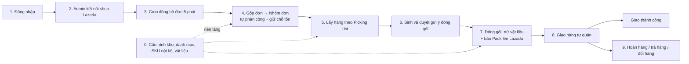
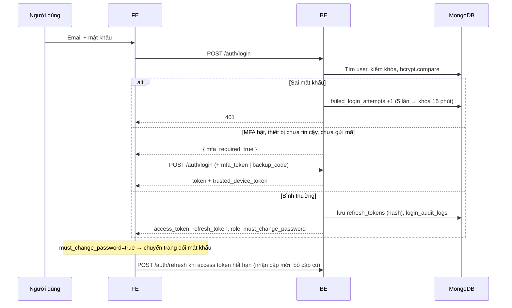
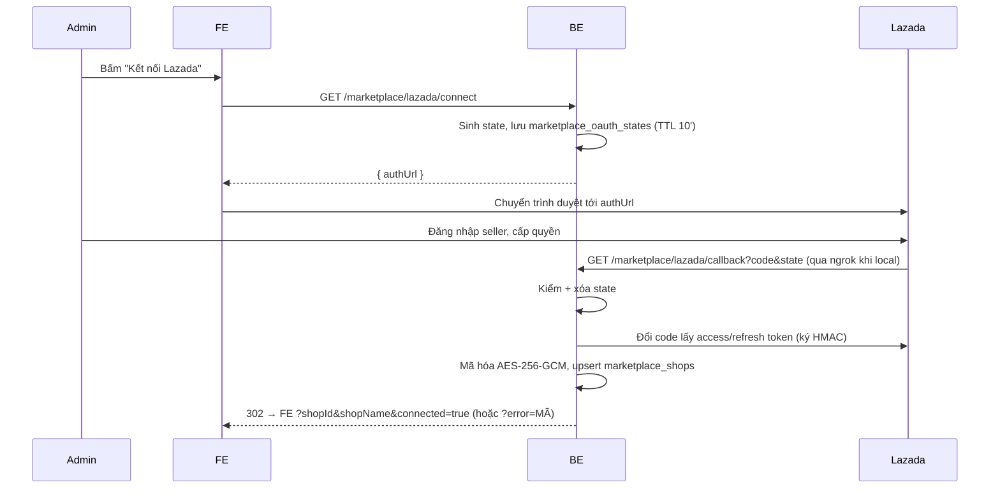
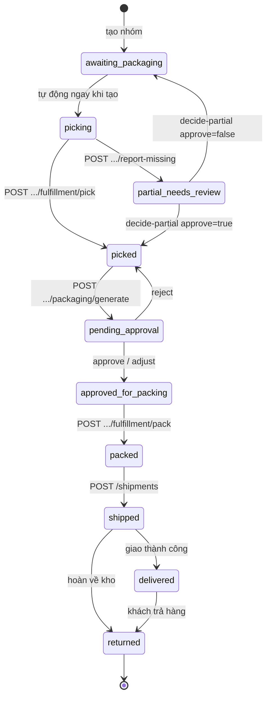
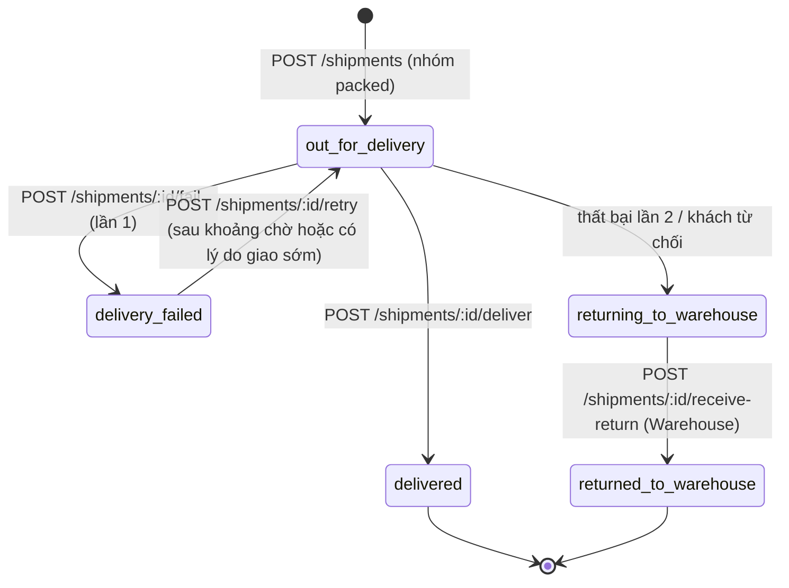
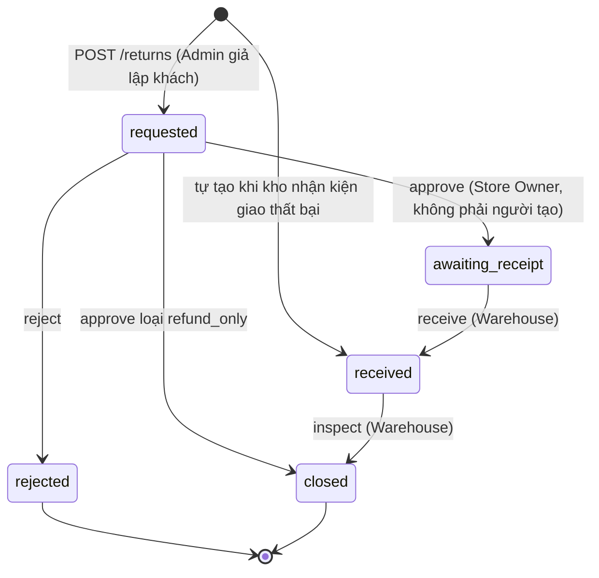

# 06 — Luồng nghiệp vụ và cách hệ thống chạy

Mỗi luồng gồm: ai thực hiện, các bước, API được gọi theo thứ tự, và dữ liệu bị thay đổi.

## Bức tranh toàn cảnh



---

## 0. Cấu hình nền (làm 1 lần trước khi vận hành)

| Bước | Ai | API | Dữ liệu |
|---|---|---|---|
| Tạo Admin đầu tiên | Kỹ thuật | `npm run seed:admin` | `users` |
| Tạo tài khoản nhân viên | Admin | `POST /users` | `users` (+ email mật khẩu tạm) |
| Danh mục + thang size | Admin | `POST /categories` | `categories` |
| Bảng màu | Admin | `POST /colors` | `colors` |
| Kho → khu → kệ/ô | Admin | `POST /warehouse/warehouses` → `POST .../zones` → `POST /warehouse/zones/:zoneId/racks` | `warehouses`, `warehouse_zones`, `bin_locations` |
| Đồng bộ danh sách sản phẩm Lazada | Admin (hoặc cron mỗi giờ / 3:00) | `POST /product-master/sync` (`?shop_id`, `?full=true`) | `product_master`, `marketplace_shops.last_product_synced_at` |
| SKU nội bộ + nối SKU sàn | Admin | `POST /master-skus` → `POST /master-skus/:code/mappings` (chỉ nối SKU đã có trong `product_master`) | `master_skus`, `marketplace_sku_mappings` |
| Gán SKU vào ô + tồn ban đầu | Admin | `POST .../sku-bin-assignments` | `sku_bin_assignments`, `inventory_movements` (`assign_initial`) |
| Gộp tồn theo SKU nội bộ | Admin | `POST /master-skus/sync-stock` | `sku_bin_assignments.master_sku`, `inventory_movements` (`sku_merge`) |
| Chuyển dữ liệu id cũ (1 lần mỗi DB, sau khi deploy bản 07/10/2026) | Kỹ thuật | `npx ts-node -r dotenv/config scripts/migrate-objectid-fields.ts --apply` | 35 trường id ở 18 collection |
| Danh mục vật liệu + nhập | Admin | `POST /packaging-materials` → `POST .../:code/purchase` | `packaging_materials`, `packaging_movements` |

---

## 1. Đăng nhập



---

## 2. Kết nối shop Lazada



---

## 3. Đồng bộ đơn và gộp đơn

**Kích hoạt:** cron 5 phút/lần (`LazadaOrderSyncScheduler`) hoặc Admin gọi `POST /orders/lazada/sync?shop_id=...`.

1. Lấy access token còn hạn (tự refresh nếu sắp hết).
2. Gọi `GetOrders` theo mốc `last_polled_at`, phân trang theo thời gian; với mỗi đơn gọi `GetOrderItems`.
3. Mapper chuẩn hóa trạng thái (`OrderStatus`), người nhận, món hàng.
4. **Upsert** `orders` theo `(platform, shop_id, platform_order_id)`; `items` được ghi đè toàn bộ.
5. Tính `consolidation_key` = SHA-256(tên + SĐT + địa chỉ đã chuẩn hóa).
6. **Gộp đơn** (`tryConsolidate`): tìm đơn chưa hoàn tất cùng khóa → gán chung `consolidated_group_id`.
7. **`getOrCreateGroupForOrder`**: tạo nhóm đơn mới hoặc cập nhật nhóm cũ, tính lại số đếm đơn hủy. Với nhóm mới gọi **`startPickingPhase`**:
   - Tự phân công Warehouse Staff ít việc nhất.
   - **Giữ chỗ tồn** cho từng SKU (thiếu → `stock_shortage=true` + thông báo).
   - Chuyển trạng thái `awaiting_packaging` → `picking`.
8. Khách yêu cầu hủy (`need_cancel_confirm`) → thông báo Store Owner.
9. Cập nhật `marketplace_shops.last_polled_at`.

**Lưới an toàn:** cron `order-group-backfill` 5 phút/lần tạo nhóm cho đơn lỡ chưa có nhóm.

---

## 4. Vòng đời nhóm đơn



---

## 5. Lấy hàng

| Bước | Ai | API | Hệ thống làm gì |
|---|---|---|---|
| Xem việc được giao | Warehouse | `GET /order-groups?fulfillment_status=picking` | Danh sách kèm `activeOrderCount`, `canceledOrderCount`, ưu tiên, hạn |
| Xem danh sách lấy hàng | Warehouse | `GET /warehouse/:warehouseId/picking-list/:groupId` | Món cần lấy (bỏ đơn hủy), ô chứa, sắp theo `pick_sequence`. Tìm dòng tồn: SKU đã nối → dòng gộp `master_sku`, nếu không có thì dòng chưa gắn nhãn cùng shop; SKU chưa nối → dòng chưa gắn nhãn cùng shop. So `seller_sku` không phân biệt hoa thường. Không có dòng nào → `CHƯA GÁN VỊ TRÍ` |
| Quét từng món | Warehouse | `POST .../fulfillment/pick-item` | Trong 1 transaction: trừ `quantity_on_hand` của ô (chỉ khi đủ, cùng cách tìm dòng tồn như trên), ghi `inventory_movements` (`pick`), `pick_events` (`order_group_id` ObjectId), tiêu thụ giữ chỗ. Trùng `client_event_id` → bỏ qua |
| Thiếu hàng | Warehouse | `POST .../fulfillment/report-missing` | Nhóm → `partial_needs_review`, thông báo |
| Quyết định thiếu | Packaging/Admin | `POST .../fulfillment/decide-partial` | Đóng gói phần có sẵn, hoặc trả về lấy lại |
| Xác nhận lấy xong | Warehouse | `POST .../fulfillment/pick` | `picking` → `picked`, nhả phần giữ chỗ còn dư |

> 🔄 **07/10/2026:** trước ngày này Picking List trả `CHƯA GÁN VỊ TRÍ` và quét hàng trả 409 dù dữ liệu kho đúng, vì `warehouse_id` được truy vấn dạng chuỗi trong khi schema bị Mongoose hiểu là Mixed. Đã sửa ở cả schema (35 trường id) lẫn truy vấn. Dữ liệu cũ: chạy `scripts/migrate-objectid-fields.ts`.

---

## 6. Đề xuất và duyệt đóng gói

1. **Admin** gọi `POST /order-groups/:groupId/packaging/generate` (nhóm phải `picked`).
2. Lấy món đã thực lấy (`pick_events`; nếu không có thì theo đơn đặt) + thông số `product_master`. 🔄 **07/10/2026:** trước đây `pick_events.order_group_id` lưu dạng chuỗi nên bước này **luôn** rơi về số lượng đặt, kể cả khi đã quét; nay đọc đúng số đã quét (nhóm đơn cũ cần chạy script chuyển dữ liệu).
3. Thuật toán dự phòng chọn thùng → lưu `packaging_recommendations` (bản cũ chuyển `is_active=false`) → nhóm `pending_approval` → thông báo Packaging Staff.
4. **Packaging Staff**:
   - `approve` (gửi cân thực tế) → `approved_for_packing`.
   - `adjust` (đổi thùng/vật liệu, ghi lý do) → `approved_for_packing`.
   - `reject` (ghi lý do) → nhóm về `picked`, sinh lại gợi ý.
   - Cân lệch > 20% so với ước tính → gắn `is_abnormal` (chưa gửi thông báo — xem 07).

---

## 7. Đóng gói và báo Lazada

```mermaid
sequenceDiagram
    participant P as Packaging Staff
    participant BE
    participant DB
    participant LZ as Lazada
    P->>BE: POST /order-groups/:id/fulfillment/pack { expected_version, materials_used? }
    BE->>DB: Nhóm còn đơn hiệu lực? (không → 409 ALL_ORDERS_CANCELED)
    BE->>DB: TRANSACTION: approved_for_packing → packed + trừ vật liệu (ưu tiên tái sử dụng)
    alt LAZADA_WRITE_APIS_ENABLED=true và có món Lazada pending
      BE->>LZ: POST /order/fulfill/pack (≤20 đơn/lô)
      LZ-->>BE: kết quả từng món (package_id, item_err_code)
    end
    BE->>DB: lưu lazada_pack_status / items trên nhóm (updateOne)
    BE-->>P: nhóm đơn + packagingConsumption + lazadaPackSync
    Note over P,BE: Lazada lỗi → nhóm vẫn packed; gửi lại bằng POST .../lazada-pack/retry
```

---

## 8. Giao hàng



- Mỗi bước ghi `shipment_events` và đổi trạng thái nhóm đơn tương ứng (`shipped`/`delivered`/`returned`).
- Cron 15 phút gắn `is_overdue` cho vận đơn quá `due_at`, gửi thông báo critical.
- Kho nhận kiện hoàn → hệ thống tự tạo phiếu trả loại `failed_delivery`.

---

## 9. Trả hàng và đổi hàng



- **Kiểm hàng** từng dòng: `restock` → nhập lại ô (`return_restock`; ô chưa có dòng tồn của SKU thì tạo dòng mới mang đúng `master_sku` nếu SKU đã nối, hoặc đủ `platform`/`shop_id`/`seller_sku` nếu chưa nối); `quarantine` → danh sách cách ly, sau xử lý bằng `POST /returns/:id/quarantine/:lineIndex/resolve`; `discard` → loại bỏ.
- Kèm kiểm **vật liệu thu hồi** (hạng A vào kho tái sử dụng nếu đã gỡ nhãn cũ và chưa quá số lần dùng; B vào kho nội bộ; C loại bỏ).
- **Đổi hàng**: sau kiểm hàng, tự tạo đơn `EXC-<mã RMA>` + nhóm đơn mới (`origin=replacement`) và đi lại luồng lấy hàng → đóng gói → giao. Lỗi thì Admin bấm `create-replacement`.

---

## 10. Vận hành kho hằng ngày

| Việc | Ai | API | Sổ cái |
|---|---|---|---|
| Xem ô và tồn theo ô | Warehouse | `GET .../bin-locations`, `GET .../sku-bin-assignments` | — |
| Nhập thêm hàng | Warehouse | `POST .../:assignmentId/restock` (🔄 07/10/2026: hết lỗi luôn 404) | `receive` |
| Kiểm kê | Warehouse | `POST .../:assignmentId/adjust` (số đếm thực tế + lý do) | `adjust` |
| Chuyển ô | Warehouse | `POST .../:assignmentId/transfer` | `transfer_out` + `transfer_in` |
| Gợi ý ô cất hàng | Warehouse | `GET .../bin-suggestions?category_code&size&color_code` | — |
| Lịch sử 1 dòng tồn | Warehouse/Owner | `GET .../:assignmentId/movements` | — |
| Xem tồn khả dụng | Owner/Warehouse | `GET /stock-availability?platform&shop_id&seller_sku` | — |

---

## 11. Gộp tồn theo SKU nội bộ

1. Admin tạo SKU nội bộ `ATHUN-005-DEN-M`, nối các SKU sàn (`POST /master-skus/:code/mappings`).
2. `POST /master-skus/sync-stock` gắn `master_sku` cho các dòng tồn đã có.
3. Từ đó `stock_key` của SKU sàn = SKU nội bộ: tồn và giữ chỗ được tính **chung** cho mọi sàn bán sản phẩm đó.
4. Nhập/thay mã sai: `POST /master-skus/:code/replace` (tạo mã mới, chuyển mapping và tồn).

---

## 12. Thông báo

| Loại | Khi nào | Mức |
|---|---|---|
| `missing_item` | Báo thiếu hàng khi lấy | critical |
| `stock_shortage` | Thiếu tồn ngay khi giữ chỗ | critical |
| `pending_approval` | Có gợi ý đóng gói chờ duyệt | info |
| `packaging_rejected` | Gợi ý bị từ chối | warning |
| `sla_warning` / `sla_breach` | Đơn hỏa tốc sắp / đã quá hạn đóng gói | warning / critical |
| `cancel_confirmation_required` | Khách yêu cầu hủy, chờ seller xác nhận | critical |
| `delivery_failed` | Giao thất bại, còn lượt giao lại | warning |
| `delivery_returning` / `delivery_overdue` | Tự hoàn về kho / quá hạn giao | critical |
| `return_requested` | Có phiếu trả/đổi mới | warning |
| `sync_failed` | Đồng bộ đơn lỗi (tối đa 1 lần / 20 phút / shop); `relatedEntityId` = id document shop đã kết nối | warning |
| `abnormal_package`, `connection_lost` | **Khai báo trong enum nhưng chưa có chỗ nào gửi** — lệch cân chỉ gắn cờ `is_abnormal`, mất kết nối shop chưa được báo | — |

`relatedEntityId` luôn là ObjectId hoặc `null` (giá trị không phải id được ghi `null`, có cảnh báo trong log). Mọi thông báo đều được gửi thêm email (tới người nhận cụ thể, hoặc mọi người đang hoạt động thuộc vai trò nhận). Lỗi gửi email chỉ ghi log, không chặn thao tác chính.

FE đọc qua `GET /notifications`, `GET /notifications/unread-count`, `PATCH /notifications/:id/read`.
