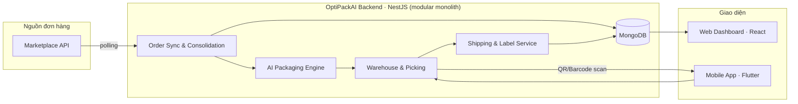

<div align="center">


# 📦 OptiPackAI

### AI-Assisted Omnichannel Order Fulfillment & Packaging Optimization System

_Đồng bộ đơn hàng đa kênh — Tối ưu đóng gói bằng AI — Cắt giảm chi phí logistics_

<br/>

[](LICENSE)
[](https://nodejs.org)
[](https://nestjs.com)
[](https://react.dev)
[](https://flutter.dev)
[](https://mongodb.com)
[](#-đóng-góp)

**Project code:** `AOFP` &nbsp;·&nbsp; **Group:** `FA26SE036` &nbsp;·&nbsp; **Duration:** 09/2026 – 03/2027 &nbsp;·&nbsp; **Supervisor:** Thân Thị Ngọc Vân

</div>

<br/>

> [!NOTE]
> Đây là hệ thống quản lý **nội bộ** (internal tool) cho một doanh nghiệp bán hàng đa kênh, không phải sản phẩm SaaS đa khách thuê.

---

## 📋 Mục lục

<table>
<tr>
<td valign="top" width="33%">

**Giới thiệu**

- [Bài toán & Giải pháp](#-bài-toán--giải-pháp)
- [Tính năng chính](#-tính-năng-chính)
- [Kiến trúc hệ thống](#-kiến-trúc-hệ-thống)

</td>
<td valign="top" width="33%">

**Kỹ thuật**

- [Tech Stack](#-tech-stack)
- [Cấu trúc dự án](#-cấu-trúc-dự-án)
- [Bắt đầu](#-bắt-đầu)
- [Scripts](#-scripts)

</td>
<td valign="top" width="33%">

**Vận hành**

- [Môi trường](#-môi-trường)
- [API Docs](#-api-documentation)
- [Git Workflow](#-git-workflow)
- [Team](#-team)

</td>
</tr>
</table>

---

## 🎯 Bài toán & Giải pháp

<table>
<tr>
<th width="50%">❌ Hiện trạng</th>
<th width="50%">✅ OptiPackAI giải quyết</th>
</tr>
<tr>
<td>

Đơn hàng rời rạc trên nhiều sàn thương mại điện tử, nhân viên kho phải tự chuyển đổi qua lại giữa các hệ thống

</td>
<td>

Đồng bộ tự động, gộp đơn trùng lặp về **một dashboard duy nhất**

</td>
</tr>
<tr>
<td>

Cần đo baseline tại kho để biết tỷ lệ dùng bao bì quá khổ và chi phí thực tế; chưa có số liệu xác minh cho dự án

</td>
<td>

**Mục tiêu:** chọn túi/carton theo hồ sơ đã xác nhận và validator; code hiện chỉ có fallback theo thể tích phục vụ demo

</td>
</tr>
<tr>
<td>

Không biết chính xác hàng nằm ở đâu trong kho, nhân viên mất thời gian tìm kiếm

</td>
<td>

**Hệ thống vị trí kho** — có vị trí SKU và Picking List sắp theo mã khu/kệ; chưa chứng minh lộ trình tối ưu

</td>
</tr>
<tr>
<td>

Không có cái nhìn tổng quan về chi phí logistics theo thời gian thực

</td>
<td>

**Dashboard phân tích** chi phí đóng gói, ship, năng suất kho

</td>
</tr>
</table>

---

## ✨ Tính năng chính

|    #    | Tính năng                 | Mô tả                                                                                           |                     Trạng thái                     |
| :-----: | ------------------------- | ----------------------------------------------------------------------------------------------- | :------------------------------------------------: |
| `FE-01` | 🔄 **Đồng bộ đa kênh**    | Tự động lấy đơn hàng từ marketplace, cron polling định kỳ                                       |                   🟢 Lazada xong                   |
| `FE-02` | 🧩 **Nhóm lấy hàng** | Mục tiêu gom để lấy cùng lượt, mỗi đơn giữ phạm vi đóng riêng | 🟡 Đã có grouping, cần sửa ràng buộc và backfill |
| `FE-03` | 🤖 **Packaging** | Đích: hồ sơ kho → túi/carton → validator; tự thông qua đơn thường | 🟡 Fallback demo có; engine 3D và tự động hóa chưa có |
| `FE-04` | 💰 **Ước tính chi phí**   | Tính phí đóng gói + cước vận chuyển trước khi giao                                              |                 🟡 Đang phát triển                 |
| `FE-05` | 🏷️ **Sinh nhãn tự động**  | QR/Barcode, PDF phiếu đóng gói & tem vận chuyển                                                 |                  ⬜ Chưa bắt đầu                   |
| `FE-06` | 📦 **Kho và Picking** | Có kệ, tồn và pick event; cần sửa kiểm tra item/transaction/idempotency | 🟡 Có API, chưa đủ điều kiện vận hành tự động |
| `FE-07` | 📱 **Mobile App**         | Quét mã cập nhật picking/packing real-time, hỗ trợ nhập tay khi không quét được                 |    🟡 API sẵn sàng, Mobile App đang phát triển     |
| `FE-08` | 📊 **Dashboard**          | Thống kê hiệu suất kho & chi phí logistics                                                      |                  ⬜ Chưa bắt đầu                   |
| `FE-09` | 🔔 **Thông báo** | Đã có module và cảnh báo thiếu hàng/SLA; chưa bao phủ toàn bộ sự kiện mục tiêu | 🟡 Đã triển khai một phần |
| `FE-10` | 🔐 **Quản trị**           | User, phân quyền theo 5 vai trò, phân công nhân viên tự động                                    |                      🟢 Xong                       |

---

## Flow đóng gói mục tiêu — cập nhật 12/09/2026

**Đợt này chỉ sửa tài liệu.** Phát triển tiếp Product Master, Order Groups, Packaging và Warehouse đang có. Một đơn nguồn là một phạm vi đóng riêng; gom nhiều đơn chỉ hỗ trợ lấy hàng, không tự gom kiện/vận đơn.

```text
Sync đơn + catalog sàn → Item đủ điều kiện của mỗi đơn → Hồ sơ kho xác nhận
→ Thiếu dữ liệu: chờ bổ sung / Đủ: tính túi-carton và validator
→ Phương án hợp lệ: tự thông qua → Phân công → Lấy và đối chiếu hàng
→ Thiếu/thay đổi: dừng và tính lại → Đóng → Cân/đo kiện thật, đối soát vật tư
→ Xác nhận đóng xong → Bàn giao vận chuyển nội bộ
```

Kho/Admin xác nhận đã đo/thử khi nhập hồ sơ, không cần Admin duyệt riêng hoặc duyệt tay từng đơn thường. Dữ liệu sàn không ghi đè hồ sơ kho; thiếu số đo không dùng 20 cm/0,5 kg. Túi zip bọc item khác túi ngoài; carton dùng số đo trong để xếp, ngoài để đánh giá kiện.

Hiện generate vẫn do Admin gọi và approve/adjust còn bắt cân trước picking; đó là hành vi cần sửa. Fallback thể tích +10% chưa chứng minh vừa hộp, không được dùng tự động cho hàng thật. Fulfillment hiện chỉ đổi trạng thái nội bộ, không gọi API giao hàng thật trên Lazada.

Thứ tự sửa: **BE-1 đầu vào/phạm vi đơn → BE-2 hồ sơ/readiness → BE-3 validator/engine → BE-4 picking/xác nhận → BE-5 tự động hóa**. Xem [roadmap chi tiết](docs/BE_PACKAGING_IMPLEMENTATION_ROADMAP.md), [thiết kế](docs/AI_3D_PACKAGING_OPTIMIZATION.md) và [API đang chạy](API_LIST.md). Chỉ bật tự động sau BE-1 đến BE-4 đạt nghiệm thu.

## 🏗 Kiến trúc hệ thống

Sơ đồ dưới là định hướng liên kết module, không xác nhận engine 3D, UI hay Shipping/Label đã triển khai. Hiện FE vẫn là starter và fulfillment là mô phỏng nội bộ.



> Backend là **1 NestJS app duy nhất** (modular monolith) — mỗi nghiệp vụ là 1 module riêng biệt bên trong cùng app, không tách microservice.

---

## 🛠 Tech Stack

<table>
<tr>
<td valign="top" width="25%">

**Backend**

- NestJS 11
- MongoDB (Atlas) + Mongoose 9
- JWT + Passport
- Swagger/OpenAPI
- class-validator
- qrcode · bwip-js · pdfkit

</td>
<td valign="top" width="25%">

**Frontend**

- React 18
- Vite
- TypeScript 5

</td>
<td valign="top" width="25%">

**Mobile**

- Flutter
- QR/Barcode scanner
- Push notifications

</td>
<td valign="top" width="25%">

**DevOps**

- Docker + Compose
- Husky + lint-staged
- Commitlint
- Jest

</td>
</tr>
</table>

---

## 📁 Cấu trúc dự án

```
OptiPackAI/
├── 📂 be/                          Backend · NestJS
│   ├── src/
│   │   ├── common/                 Shared utilities, filters, interceptors
│   │   ├── config/                 Configuration files
│   │   └── modules/
│   │       ├── auth/                       🔐 Đăng nhập, MFA, phân quyền
│   │       ├── users/                       👤 Quản lý người dùng
│   │       ├── marketplace-integration/    🔌 Connector marketplace (OAuth, adapter)
│   │       ├── orders/                     🔄 Đồng bộ đơn hàng                    FE-01
│   │       ├── product-master/             📦 Cache kích thước/cân nặng sản phẩm
│   │       ├── order-groups/               🧩 Gộp đơn, fulfillment, phân công NV FE-02 FE-10
│   │       ├── packaging/                  🤖 AI packaging recommendation        FE-03
│   │       └── warehouse/                  📦 Vị trí kho, picking list           FE-06
│   ├── test/
│   └── Dockerfile
│
├── 📂 fe/                          Frontend · React + Vite
├── 📂 mobile/                      Mobile App · Flutter
├── 📂 docker/
├── 📂 .husky/
├── 🐳 docker-compose.yml
└── 📦 package.json                 npm workspaces: be, fe
```

---

## 🚀 Bắt đầu

### Yêu cầu hệ thống

| Công cụ                 | Phiên bản |
| ----------------------- | --------- |
| Node.js                 | ≥ 20.0.0  |
| npm                     | ≥ 10.0.0  |
| Docker & Docker Compose | mới nhất  |
| Git                     | mới nhất  |

### Cài đặt

```bash
# 1️⃣ Clone repository
git clone https://github.com/ThuaanNguyeen111/OptiPackAI.git
cd OptiPackAI

# 2️⃣ Cài đặt dependencies
npm install
cd be && npm install
cd ../fe && npm install
cd ..

# 3️⃣ Cấu hình môi trường
cp .env.example .env
cp be/.env.example be/.env
cp fe/.env.example fe/.env

# 4️⃣ Khởi động MongoDB (Docker)
npm run docker:dev

# 5️⃣ Chạy development
npm run dev
```

> **Test luồng OAuth marketplace cục bộ**: cần tunnel HTTPS public cho OAuth callback (marketplace không nhận `localhost`). Dùng `ngrok http --url=<domain-cố-định-của-bạn> 3000`, và cần Redis chạy sẵn (Docker, hoặc Memurai trên Windows nếu không tiện dùng Docker/WSL). MongoDB dùng Atlas (cloud) cho cả dev lẫn production, không cần cài MongoDB local.

<div align="center">

🟢 Backend: `http://localhost:3000` &nbsp;·&nbsp; 🔵 Frontend: `http://localhost:5173`

</div>

---

## 📜 Scripts

<details>
<summary><b>Root (Monorepo)</b></summary>
<br/>

| Script                | Mô tả                            |
| --------------------- | -------------------------------- |
| `npm run dev`         | Chạy cả Backend và Frontend      |
| `npm run dev:be`      | Chạy riêng Backend               |
| `npm run dev:fe`      | Chạy riêng Frontend              |
| `npm run build`       | Build cả Backend và Frontend     |
| `npm run lint`        | Lint toàn bộ project             |
| `npm run docker:dev`  | Khởi động MongoDB, Mongo Express |
| `npm run docker:down` | Dừng Docker containers           |

</details>

<details>
<summary><b>Backend</b></summary>
<br/>

| Script              | Mô tả                           |
| ------------------- | ------------------------------- |
| `npm run start:dev` | Development mode với hot-reload |
| `npm run build`     | Build production                |
| `npm run test`      | Chạy unit tests                 |
| `npm run test:cov`  | Test coverage                   |

</details>

---

## 🔐 Môi trường

<details>
<summary><b>Xem danh sách biến môi trường</b></summary>
<br/>

| Variable                               | Mô tả                                                           |
| -------------------------------------- | --------------------------------------------------------------- |
| `MONGODB_URI`                          | MongoDB Atlas connection string                                 |
| `JWT_SECRET`                           | JWT signing key                                                 |
| `CORS_ORIGIN`                          | Allowed CORS origins (mặc định `http://localhost:5173`)         |
| `CLIENT_REDIRECT_CALLBACK`             | URL public (ngrok) FE dùng để nhận callback OAuth khi dev local |
| `LAZADA_APP_KEY` / `LAZADA_APP_SECRET` | Lazada Open Platform credentials (ISV Console)                  |
| `REDIS_URL`                            | Redis / Redis-compatible (vd Memurai) connection string         |

</details>

| Service       | URL                       |
| ------------- | ------------------------- |
| MongoDB       | Atlas (cloud, xem `.env`) |
| Mongo Express | `http://localhost:8081`   |

---

## 📚 API Documentation

<div align="center">

📖 Swagger UI: **`http://localhost:3000/api/docs`**

</div>

> ⚠️ **Không có tiền tố `/api/v1`** — route thật gọn hơn phiếu đề xuất ban đầu, ví dụ `/auth/login` chứ không phải `/api/v1/auth/login`.

Chi tiết đầy đủ cho FE tích hợp, kèm ví dụ request/response, bảng mã lỗi, và checklist test bắt buộc:

| Tài liệu                           | Phạm vi                              |
| ---------------------------------- | ------------------------------------ |
| `INTEGRATION_GUIDE.md`             | Auth / Users                         |
| `INTEGRATION_GUIDE_ORDERS.md`      | Orders / Marketplace Integration     |
| `INTEGRATION_GUIDE_FULFILLMENT.md` | Order Groups / Packaging / Warehouse |

---

## 🔄 Git Workflow

### Branch strategy

```
main        ← code ổn định, sẵn sàng release
 └─ develop  ← nhánh hội tụ tính năng đang phát triển
     └─ feature/AOFP-XX_ten-tinh-nang  ← nhánh tính năng, tạo từ develop
```

### Commit Message

Conventional Commits + mã ticket Jira đặt trong `scope`:

```bash
type(AOFP-XX): mô tả ngắn gọn
```

```bash
✅ feat(AOFP-12): add Lazada order sync module
✅ fix(AOFP-15): resolve duplicate order detection bug
✅ docs(AOFP-20): update API documentation for orders module
```

<sup>Type hợp lệ: `feat` `fix` `docs` `style` `refactor` `perf` `test` `build` `ci` `chore` `revert`</sup>

### Pull Request

- 🚫 Không push trực tiếp lên `main`/`develop`
- ✅ Bắt buộc ≥ 1 reviewer approve trước khi merge
- ✅ Phải pass Unit Test trước khi merge

---

## 🤝 Đóng góp

```bash
git checkout -b feature/AOFP-XX_ten-tinh-nang   # 1. Tạo nhánh từ develop
git commit -m "feat(AOFP-XX): mô tả thay đổi"    # 2. Commit theo convention
git push origin feature/AOFP-XX_ten-tinh-nang    # 3. Push
```

4. Tạo Pull Request vào `develop` → chờ ≥ 1 thành viên review & approve

---

## 👥 Team — FA26SE036

<div align="center">

|         Role          | Name                   | Email                       |
| :-------------------: | ---------------------- | --------------------------- |
|     🎓 Supervisor     | Thân Thị Ngọc Vân      | vanttn@fpt.edu.vn           |
|       👑 Leader       | Nguyễn Phương Mỹ Thuận | ThuanNPMSE171113@fpt.edu.vn |
| ⚙️ Backend Developer  | Lê Đức Trung Thi       | thildtde180553@fpt.edu.vn   |
| 🎨 Frontend Developer | Huỳnh Quốc Việt        | viethqse182482@fpt.edu.vn   |
| 🎨 Frontend Developer | Phan Huỳnh Hải Phượng  | haifuong2408@gmail.com      |

</div>

---

<div align="center">

## 📄 License

**UNLICENSED** — Proprietary software, phát triển trong khuôn khổ Capstone Project FA26SE036

<br/>

Made with 🧠 by **OptiPackAI Team**

</div>
