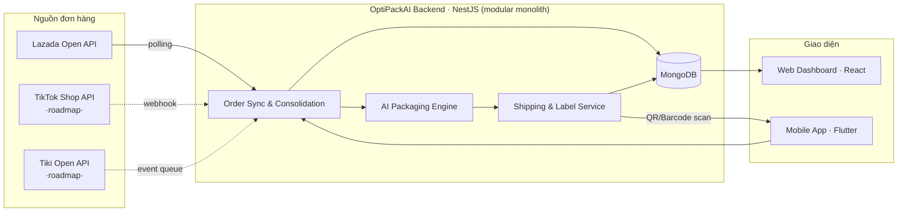

<div align="center">


# 📦 OptiPackAI

### AI-Assisted Omnichannel Order Fulfillment & Packaging Optimization System

_Đồng bộ đơn hàng đa kênh — Tối ưu đóng gói bằng AI — Cắt giảm chi phí logistics_

<br/>

[](LICENSE)
[](https://nodejs.org)
[](https://nestjs.com)
[](https://react.dev)
[](https://flutter.dev)
[](https://mongodb.com)
[](#-đóng-góp)

**Project code:** `AOFP` &nbsp;·&nbsp; **Group:** `FA26SE036` &nbsp;·&nbsp; **Duration:** 09/2026 – 03/2027 &nbsp;·&nbsp; **Supervisor:** Thân Thị Ngọc Vân

</div>

<br/>

> [!NOTE]
> Đây là hệ thống quản lý **nội bộ** (internal tool) cho một doanh nghiệp bán hàng đa kênh, không phải sản phẩm SaaS đa khách thuê.

> [!IMPORTANT]
> **Phạm vi tích hợp sàn đã đổi so với phiếu đề xuất ban đầu.** Bản gốc nhắm Shopee + TikTok Shop. Sau khi khảo sát thực tế điều kiện đăng ký (Shopee yêu cầu shop đã đạt Preferred/Mall Seller mới cấp được Partner Key qua route cá nhân; TikTok Shop Partner Center yêu cầu giấy phép kinh doanh + công ty thành lập >1 năm), **cả 2 sàn đều không khả thi cho route đăng ký cá nhân/sinh viên**. Sàn tích hợp đang code tích cực hiện tại là **Lazada** — đã chạy end-to-end thành công (OAuth connect → đồng bộ đơn hàng thật). TikTok Shop và Tiki vẫn trong roadmap nhưng tạm hoãn.

---

## 📋 Mục lục

<table>
<tr>
<td valign="top" width="33%">

**Giới thiệu**

- [Bài toán & Giải pháp](#-bài-toán--giải-pháp)
- [Tính năng chính](#-tính-năng-chính)
- [Kiến trúc hệ thống](#-kiến-trúc-hệ-thống)

</td>
<td valign="top" width="33%">

**Kỹ thuật**

- [Tech Stack](#-tech-stack)
- [Cấu trúc dự án](#-cấu-trúc-dự-án)
- [Bắt đầu](#-bắt-đầu)
- [Scripts](#-scripts)

</td>
<td valign="top" width="33%">

**Vận hành**

- [Môi trường](#-môi-trường)
- [API Docs](#-api-documentation)
- [Git Workflow](#-git-workflow)
- [Team](#-team)

</td>
</tr>
</table>

---

## 🎯 Bài toán & Giải pháp

<table>
<tr>
<th width="50%">❌ Hiện trạng</th>
<th width="50%">✅ OptiPackAI giải quyết</th>
</tr>
<tr>
<td>

Đơn hàng rời rạc trên nhiều sàn (Lazada, TikTok Shop, Tiki...), nhân viên kho phải tự chuyển đổi qua lại giữa các hệ thống

</td>
<td>

Đồng bộ tự động, gộp đơn trùng lặp về **một dashboard duy nhất**

</td>
</tr>
<tr>
<td>

Đóng gói dựa cảm tính → ~15-20% đơn dùng thùng quá khổ, tốn thêm 10-15% phí ship

</td>
<td>

**AI 3D Bin Packing** gợi ý chính xác kích thước thùng & vật liệu đệm lót

</td>
</tr>
<tr>
<td>

Không có cái nhìn tổng quan về chi phí logistics theo thời gian thực

</td>
<td>

**Dashboard phân tích** chi phí đóng gói, ship, năng suất kho

</td>
</tr>
</table>

---

## ✨ Tính năng chính

|    #    | Tính năng                 | Mô tả                                                                           | Trạng thái |
| :-----: | ------------------------- | -------------------------------------------------------------------------------- | :---: |
| `FE-01` | 🔄 **Đồng bộ đa kênh**    | Tự động lấy đơn hàng từ Lazada (đã chạy); TikTok Shop, Tiki dự kiến sau         | 🟢 Lazada xong |
| `FE-02` | 🧩 **Gộp đơn thông minh** | Phát hiện & gộp đơn trùng lặp theo khách hàng/địa chỉ (`consolidation_key`)      | 🟡 Đang test |
| `FE-03` | 🤖 **AI Packaging**       | 3D Bin Packing — gợi ý thùng & vật liệu, có xác nhận thủ công trước khi in nhãn | ⬜ Chưa bắt đầu |
| `FE-04` | 💰 **Ước tính chi phí**   | Tính phí đóng gói + cước vận chuyển trước khi giao                              | ⬜ Chưa bắt đầu |
| `FE-05` | 🏷️ **Sinh nhãn tự động**  | QR/Barcode, PDF phiếu đóng gói & tem vận chuyển                                 | ⬜ Chưa bắt đầu |
| `FE-06` | 📱 **Mobile App**         | Quét mã cập nhật picking/packing real-time                                      | ⬜ Chưa bắt đầu |
| `FE-07` | 📊 **Dashboard**          | Thống kê hiệu suất kho & chi phí logistics                                      | ⬜ Chưa bắt đầu |
| `FE-08` | 🔐 **Quản trị**           | User, phân quyền, cấu hình tham số AI                                           | 🟢 Auth/Users xong |

> **Phạm vi tích hợp hiện tại:** Lazada _(code tích cực, đã chạy end-to-end)_ · TikTok Shop + Tiki _(roadmap, tạm hoãn)_ · Shopee, Facebook Marketplace _(loại khỏi phạm vi — xem ghi chú đầu trang)_

---

## 🏗 Kiến trúc hệ thống



> Backend là **1 NestJS app duy nhất** (modular monolith), không tách microservice — AI Packaging Engine (Package 3) là 1 module bên trong cùng app, không phải service riêng.

---

## 🛠 Tech Stack

<table>
<tr>
<td valign="top" width="25%">

**Backend**

- NestJS 11
- MongoDB 7 + Mongoose 8
- JWT + Passport
- Swagger/OpenAPI
- class-validator
- qrcode · bwip-js · pdfkit

</td>
<td valign="top" width="25%">

**Frontend**

- React 18
- Vite
- TypeScript 5

</td>
<td valign="top" width="25%">

**Mobile**

- Flutter
- QR/Barcode scanner
- Push notifications

</td>
<td valign="top" width="25%">

**DevOps**

- Docker + Compose
- Husky + lint-staged
- Commitlint
- Jest

</td>
</tr>
</table>

---

## 📁 Cấu trúc dự án

```
OptiPackAI/
├── 📂 be/                          Backend · NestJS
│   ├── src/
│   │   ├── common/                 Shared utilities, filters, interceptors
│   │   ├── config/                 Configuration files
│   │   └── modules/
│   │       ├── orders/                     🔄 Đồng bộ & gộp đơn hàng          FE-01 FE-02
│   │       ├── packaging/                  🤖 AI packaging recommendation    FE-03
│   │       ├── shipping/                   💰 Ước tính phí, tạo nhãn         FE-04 FE-05
│   │       ├── fulfillment/                📦 Picking/packing tracking      FE-06 FE-07
│   │       ├── marketplace-integration/    🔌 Connector Lazada (xong), TikTok/Tiki (roadmap)
│   │       └── admin/                      🔐 User, role, AI config          FE-08
│   ├── test/
│   └── Dockerfile
│
├── 📂 fe/                          Frontend · React + Vite
├── 📂 mobile/                      Mobile App · Flutter
├── 📂 docker/
├── 📂 .husky/
├── 🐳 docker-compose.yml
└── 📦 package.json                 npm workspaces: be, fe
```

---

## 🚀 Bắt đầu

### Yêu cầu hệ thống

| Công cụ                 | Phiên bản |
| ----------------------- | --------- |
| Node.js                 | ≥ 20.0.0  |
| npm                     | ≥ 10.0.0  |
| Docker & Docker Compose | mới nhất  |
| Git                     | mới nhất  |

### Cài đặt

```bash
# 1️⃣ Clone repository
git clone https://github.com/ThuaanNguyeen111/OptiPackAI.git
cd OptiPackAI

# 2️⃣ Cài đặt dependencies
npm install
cd be && npm install
cd ../fe && npm install
cd ..

# 3️⃣ Cấu hình môi trường
cp .env.example .env
cp be/.env.example be/.env
cp fe/.env.example fe/.env

# 4️⃣ Khởi động MongoDB (Docker)
npm run docker:dev

# 5️⃣ Chạy development
npm run dev
```

> **Test luồng Lazada cục bộ**: cần tunnel HTTPS public cho OAuth callback (Lazada không nhận `localhost`). Dùng `ngrok http --url=<domain-cố-định-của-bạn> 3000`, và cần Redis chạy sẵn (Docker, hoặc Memurai trên Windows nếu không tiện dùng Docker/WSL).

<div align="center">

🟢 Backend: `http://localhost:3000` &nbsp;·&nbsp; 🔵 Frontend: `http://localhost:5173`

</div>

---

## 📜 Scripts

<details>
<summary><b>Root (Monorepo)</b></summary>
<br/>

| Script                | Mô tả                            |
| --------------------- | --------------------------------- |
| `npm run dev`         | Chạy cả Backend và Frontend      |
| `npm run dev:be`      | Chạy riêng Backend               |
| `npm run dev:fe`      | Chạy riêng Frontend              |
| `npm run build`       | Build cả Backend và Frontend     |
| `npm run lint`        | Lint toàn bộ project             |
| `npm run docker:dev`  | Khởi động MongoDB, Mongo Express |
| `npm run docker:down` | Dừng Docker containers           |

</details>

<details>
<summary><b>Backend</b></summary>
<br/>

| Script              | Mô tả                           |
| -------------------- | -------------------------------- |
| `npm run start:dev`  | Development mode với hot-reload |
| `npm run build`      | Build production                |
| `npm run test`       | Chạy unit tests                 |
| `npm run test:cov`   | Test coverage                   |

</details>

---

## 🔐 Môi trường

<details>
<summary><b>Xem danh sách biến môi trường</b></summary>
<br/>

| Variable                                     | Mô tả                                                                 |
| --------------------------------------------- | ---------------------------------------------------------------------- |
| `MONGODB_URI`                                | MongoDB connection string                                             |
| `JWT_SECRET`                                 | JWT signing key                                                       |
| `CORS_ORIGIN`                                | Allowed CORS origins (mặc định `http://localhost:5173`)              |
| `CLIENT_REDIRECT_CALLBACK`                   | URL public (ngrok) FE dùng để nhận callback OAuth Lazada khi dev local |
| `LAZADA_APP_KEY` / `LAZADA_APP_SECRET`       | Lazada Open Platform credentials (ISV Console)                        |
| `REDIS_URL`                                  | Redis / Redis-compatible (vd Memurai) connection string               |

> `SHOPEE_PARTNER_ID`/`SHOPEE_PARTNER_KEY` và `TIKTOK_APP_KEY`/`TIKTOK_APP_SECRET` **đã bị gỡ** khỏi `.env.example` — Shopee ngoài phạm vi, TikTok tạm hoãn (xem ghi chú đầu trang). Thêm lại khi 2 sàn này quay lại roadmap thật sự.

</details>

| Service       | URL                          |
| ------------- | ----------------------------- |
| MongoDB       | `mongodb://localhost:27017`  |
| Mongo Express | `http://localhost:8081`      |

---

## 📚 API Documentation

<div align="center">

📖 Swagger UI: **`http://localhost:3000/api/docs`**

</div>

> ⚠️ **Không có tiền tố `/api/v1`** — route thật gọn hơn phiếu đề xuất ban đầu, ví dụ `/auth/login` chứ không phải `/api/v1/auth/login`. Danh sách dưới đây phản ánh route **thật đang chạy**:

```http
POST   /auth/login                       # Đăng nhập
GET    /auth/google                      # Đăng nhập Google (redirect)
GET    /marketplace/lazada/connect       # Khởi tạo OAuth connect Lazada (chỉ Admin, trả authUrl)
GET    /marketplace/lazada/callback      # Callback OAuth Lazada (Lazada tự gọi, public, trả JSON thô)
POST   /orders/lazada/sync               # Đồng bộ đơn hàng từ Lazada (theo shop_id)
GET    /orders                           # Danh sách đơn hàng đã gộp
POST   /packaging/recommend              # AI gợi ý đóng gói           (chưa code)
GET    /shipping/estimate                # Ước tính phí ship          (chưa code)
POST   /fulfillment/scan                 # Cập nhật trạng thái picking/packing (chưa code)
```

> ⚠️ Toàn bộ route `/marketplace/*` và `/orders/*` ở trên hiện **giới hạn role Admin** — user role khác gọi vào sẽ nhận `403`, đây là chủ đích (kết nối shop/đồng bộ đơn coi là hành động nhạy cảm), không phải thiếu sót.

Chi tiết đầy đủ cho FE tích hợp: xem `INTEGRATION_GUIDE.md` (module Auth/Users) và `INTEGRATION_GUIDE_ORDERS.md` (module Orders + Marketplace Integration).

---

## 🔄 Git Workflow

### Branch strategy

```
main        ← code ổn định, sẵn sàng release
 └─ develop  ← nhánh hội tụ tính năng đang phát triển
     └─ feature/AOFP-XX_ten-tinh-nang  ← nhánh tính năng, tạo từ develop
```

### Commit Message

Conventional Commits + mã ticket Jira đặt trong `scope`:

```bash
type(AOFP-12): mô tả ngắn gọn
```

```bash
✅ feat(AOFP-12): add Lazada order sync module
✅ fix(AOFP-15): resolve duplicate order detection bug
✅ docs(AOFP-20): update API documentation for orders module
```

<sup>Type hợp lệ: `feat` `fix` `docs` `style` `refactor` `perf` `test` `build` `ci` `chore` `revert`</sup>

### Pull Request

- 🚫 Không push trực tiếp lên `main`/`develop`
- ✅ Bắt buộc ≥ 1 reviewer approve trước khi merge
- ✅ Phải pass Unit Test trước khi merge

---

## 🤝 Đóng góp

```bash
git checkout -b feature/AOFP-XX_ten-tinh-nang   # 1. Tạo nhánh từ develop
git commit -m "feat(AOFP-XX): mô tả thay đổi"    # 2. Commit theo convention
git push origin feature/AOFP-XX_ten-tinh-nang    # 3. Push
```

4. Tạo Pull Request vào `develop` → chờ ≥ 1 thành viên review & approve

---

## 👥 Team — FA26SE036

<div align="center">

|         Role          | Name                   | Email                       | Mobile     |
| :-------------------: | ----------------------- | ----------------------------- | ---------- |
|     🎓 Supervisor     | Thân Thị Ngọc Vân      | vanttn@fpt.edu.vn           | 0912656836 |
|       👑 Leader       | Nguyễn Phương Mỹ Thuận | ThuanNPMSE171113@fpt.edu.vn | 0377168254 |
| ⚙️ Backend Developer  | Lê Đức Trung Thi       | thildtde180553@fpt.edu.vn   | 0905749864 |
| 🎨 Frontend Developer | Huỳnh Quốc Việt        | viethqse182482@fpt.edu.vn   | 0813076315 |
| 🎨 Frontend Developer | Phan Huỳnh Hải Phượng  | haifuong2408@gmail.com      | 0708639363 |

</div>

---

<div align="center">

## 📄 License

**UNLICENSED** — Proprietary software, phát triển trong khuôn khổ Capstone Project FA26SE036

<br/>

Made with 🧠 by **OptiPackAI Team**

</div>
