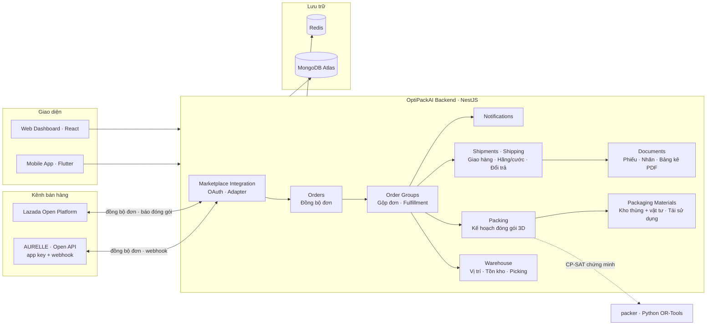
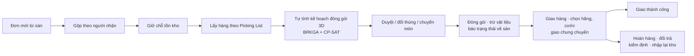

<div align="center">

# OptiPackAI

**Nền tảng vận hành đơn hàng đa kênh và tối ưu đóng gói cho doanh nghiệp bán hàng trực tuyến**

Đồng bộ đơn từ sàn thương mại điện tử · Gộp đơn theo người nhận · Quản lý kho theo vị trí · Đề xuất đóng gói tối ưu · Giao hàng và đổi trả khép kín

[](https://nestjs.com)
[](https://react.dev)
[](https://www.mongodb.com/atlas)
[](https://www.typescriptlang.org)
[](https://nodejs.org)
[](#giấy-phép)

**Mã dự án:** `AOFP` · **Nhóm:** `FA26SE036` · **Thời gian:** 09/2026 – 03/2027 · **Giảng viên hướng dẫn:** Thân Thị Ngọc Vân

</div>

---

## Giới thiệu

OptiPackAI là hệ thống quản lý nội bộ dành cho doanh nghiệp bán hàng trên nhiều kênh thương mại điện tử. Hệ thống tập trung đơn hàng từ các sàn về một nơi, tự động gộp các đơn của cùng một người nhận để đóng chung một kiện, điều phối toàn bộ quy trình kho từ lấy hàng, đóng gói đến giao hàng, và đồng bộ trạng thái xử lý ngược lại sàn.

Trọng tâm của dự án là **giảm chi phí đóng gói và vận chuyển**: chọn đúng kích thước thùng và vật liệu đệm cho từng kiện, tái sử dụng vật liệu thu hồi, và rút ngắn quãng đường lấy hàng trong kho.

### Điểm nổi bật

- **Đồng bộ đơn hàng tự động** từ Lazada qua Lazada Open Platform (OAuth 2.0, tự làm mới token, đồng bộ định kỳ), kiến trúc adapter sẵn sàng mở rộng thêm sàn.
- **Gộp đơn theo người nhận** — các đơn cùng sàn, cùng người nhận và địa chỉ được xử lý thành một nhóm đơn, một kiện hàng.
- **Quản lý kho theo vị trí** — mã vị trí 5 cấp, một SKU có thể nằm ở nhiều ô, Picking List sắp theo lộ trình di chuyển, sổ cái biến động tồn bất biến.
- **Giữ chỗ tồn kho theo SKU nội bộ** — gộp tồn của cùng một sản phẩm đăng trên nhiều sàn, phát hiện thiếu hàng ngay khi đơn về.
- **Đề xuất đóng gói** — gợi ý kích thước thùng và vật liệu đệm theo kích thước, khối lượng và độ dễ vỡ của hàng; nhân viên duyệt, điều chỉnh hoặc từ chối.
- **Quản lý vật liệu đóng gói** — tồn vật liệu mới và tái sử dụng, tự trừ khi đóng gói, thu hồi khi hàng hoàn, thống kê chi phí tiết kiệm.
- **Giao hàng, đổi trả khép kín** — vận đơn tự giao, giới hạn số lần giao, cảnh báo quá hạn; phiếu trả hàng có kiểm định, hàng cách ly và đơn đổi hàng.
- **Báo trạng thái đóng gói về sàn** — xác nhận "đã đóng gói" trên OptiPack được gửi lên Lazada qua Fulfillment API.

---

## Mục lục

- [Kiến trúc hệ thống](#kiến-trúc-hệ-thống)
- [Quy trình nghiệp vụ](#quy-trình-nghiệp-vụ)
- [Chức năng theo phân hệ](#chức-năng-theo-phân-hệ)
- [Vai trò người dùng](#vai-trò-người-dùng)
- [Công nghệ sử dụng](#công-nghệ-sử-dụng)
- [Cấu trúc mã nguồn](#cấu-trúc-mã-nguồn)
- [Bắt đầu](#bắt-đầu)
- [Tài liệu](#tài-liệu)
- [Quy trình phát triển](#quy-trình-phát-triển)
- [Định hướng phát triển](#định-hướng-phát-triển)
- [Nhóm phát triển](#nhóm-phát-triển)
- [Giấy phép](#giấy-phép)

---

## Kiến trúc hệ thống

Backend được xây dựng theo mô hình **modular monolith**: một ứng dụng NestJS duy nhất, mỗi nghiệp vụ là một module độc lập với ranh giới rõ ràng. Kết nối sàn thương mại điện tử đi qua lớp **adapter** chuẩn hóa, nên dữ liệu bên trong hệ thống không phụ thuộc vào định dạng riêng của từng sàn.


```mermaid
flowchart LR
    subgraph Channels["Kênh bán hàng"]
        LZ[Lazada Open Platform]
        AU[AURELLE · Open API<br/>app key + webhook]
    end

    subgraph Backend["OptiPackAI Backend · NestJS"]
        MI[Marketplace Integration<br/>OAuth · Adapter]
        OR[Orders<br/>Đồng bộ đơn]
        OG[Order Groups<br/>Gộp đơn · Fulfillment]
        WH[Warehouse<br/>Vị trí · Tồn kho · Picking]
        PK[Packing<br/>Kế hoạch đóng gói 3D]
        PM[Packaging Materials<br/>Kho thùng + vật tư · Tái sử dụng]
        SH[Shipments · Shipping<br/>Giao hàng · Hãng/cước · Đổi trả]
        DOC[Documents<br/>Phiếu · Nhãn · Bảng kê PDF]
        NT[Notifications]
    end

    subgraph Data["Lưu trữ"]
        DB[(MongoDB Atlas)]
        RD[(Redis)]
    end

    subgraph Clients["Giao diện"]
        WEB[Web Dashboard · React]
        APP[Mobile App · Flutter]
    end

    LZ <-->|đồng bộ đơn · báo đóng gói| MI
    AU <-->|đồng bộ đơn · webhook| MI
    PK -.->|CP-SAT chứng minh| PKR[packer · Python OR-Tools]
    MI --> OR --> OG
    OG --> WH
    OG --> PK --> PM
    OG --> SH --> DOC
    OG --> NT
    Backend --> DB
    Backend --> RD
    WEB --> Backend
    APP --> Backend
```

---

## Quy trình nghiệp vụ


```mermaid
flowchart LR
    A[Đơn mới từ sàn] --> B[Gộp theo người nhận]
    B --> C[Giữ chỗ tồn kho]
    C --> D[Lấy hàng theo Picking List]
    D --> E[Tự tính kế hoạch đóng gói 3D<br/>BRKGA + CP-SAT]
    E --> F[Duyệt / đổi thùng / chuyển món]
    F --> G[Đóng gói · trừ vật liệu<br/>báo trạng thái về sàn]
    G --> H[Giao hàng · chọn hãng, cước<br/>giao chung chuyến]
    H --> I[Giao thành công]
    H --> J[Hoàn hàng · đổi trả<br/>kiểm định · nhập lại kho]
```

Mọi bước chuyển trạng thái của nhóm đơn đều được kiểm soát bằng bảng chuyển trạng thái hợp lệ và khóa phiên bản (optimistic concurrency), bảo đảm nhiều nhân viên thao tác đồng thời không ghi đè lên nhau.

---

## Chức năng theo phân hệ

| Phân hệ                    | Chức năng chính                                                                                                                                                                                   |
| -------------------------- | ------------------------------------------------------------------------------------------------------------------------------------------------------------------------------------------------- |
| **Xác thực & người dùng**  | Đăng nhập JWT với xoay vòng refresh token, xác thực hai lớp (TOTP, mã dự phòng), thiết bị tin cậy, đăng nhập Google, bắt buộc đổi mật khẩu lần đầu, nhật ký đăng nhập, giới hạn tần suất truy cập |
| **Kết nối sàn**            | Ủy quyền OAuth 2.0, mã hóa token khi lưu, tự làm mới token sắp hết hạn, adapter riêng cho từng sàn. Lazada + AURELLE (Open API tương thích Lazada, kết nối bằng app key, webhook có chữ ký) |
| **Đơn hàng**               | Đồng bộ định kỳ và đồng bộ theo yêu cầu, chuẩn hóa trạng thái đơn, theo dõi yêu cầu hủy từ người mua                                                                                              |
| **Nhóm đơn & fulfillment** | Gộp đơn theo người nhận, phân công nhân viên tự động, đơn hỏa tốc với hạn xử lý theo giờ làm việc, báo thiếu hàng, xác nhận đóng gói và đồng bộ trạng thái lên sàn                                |
| **Kho hàng**               | Nhiều kho, khu, kệ, ô với mã vị trí 5 cấp; quy định danh mục, cỡ, màu cho từng ô; gợi ý ô cất hàng; nhập hàng, kiểm kê, chuyển ô; sổ cái biến động tồn; Picking List theo lộ trình                |
| **SKU & tồn kho**          | SKU nội bộ liên kết SKU trên các sàn, danh mục và bảng màu chuẩn, giữ chỗ tồn kho theo nhóm đơn, cảnh báo thiếu hàng                                                                              |
| **Đóng gói**               | Tự tính kế hoạch đóng gói 3D cho cả nhóm đơn (nhiều kiện/đơn) bằng BRKGA, chứng minh tối ưu bằng CP-SAT cho đơn nhỏ; chỉ dùng số đo SKU do kho xác nhận; màn làm việc 3D, đổi thùng, chuyển món, hướng dẫn đóng gói từng bước bằng AI, cân từng kiện |
| **Vật liệu đóng gói**      | Danh mục vật liệu có đơn giá, tồn mới / tái sử dụng / nội bộ, tự trừ khi đóng gói, thu hồi khi kiểm hàng hoàn, thống kê chi phí tiết kiệm                                                         |
| **Giao hàng & đổi trả**    | Vận đơn tự giao, tối đa hai lần giao, cảnh báo quá hạn; chọn hãng + báo cước theo kiện thật (bảng cước mẫu), giao chung chuyến cho cùng người nhận, lịch lấy hàng; phiếu đóng gói, nhãn từng kiện, bảng kê chuyến (PDF); phiếu trả hàng có kiểm định, tự tạo đơn đổi hàng |
| **Thông báo**              | Thông báo trong ứng dụng cho các sự kiện giao thất bại, quá hạn giao, yêu cầu trả hàng, thiếu hàng                                                                                                |

---

## Vai trò người dùng

| Vai trò                  | Phạm vi công việc                                                    |
| ------------------------ | -------------------------------------------------------------------- |
| **Admin**                | Quản trị người dùng, cấu hình kho, kết nối sàn, toàn quyền hệ thống  |
| **Store Owner**          | Theo dõi vận hành, duyệt trả hàng, ưu tiên đơn, xem thống kê chi phí |
| **Warehouse Staff**      | Lấy hàng, nhập hàng, kiểm kê, chuyển ô, nhận và kiểm hàng hoàn       |
| **Packaging Staff**      | Duyệt / chỉnh kế hoạch đóng gói, đóng gói, cân và xác nhận hoàn tất  |
| **Shipping Coordinator** | Tạo vận đơn, cập nhật kết quả giao hàng                              |

---

## Công nghệ sử dụng

| Lớp               | Công nghệ                                                                                                                                                  |
| ----------------- | ---------------------------------------------------------------------------------------------------------------------------------------------------------- |
| **Backend**       | NestJS 11, TypeScript 5, Mongoose 9, Passport JWT, class-validator, `@nestjs/schedule`, `@nestjs/throttler`, Swagger / OpenAPI, Helmet, Nodemailer, otplib |
| **Cơ sở dữ liệu** | MongoDB Atlas (replica set, hỗ trợ transaction), Redis (bộ nhớ đệm và trạng thái tạm)                                                                      |
| **Frontend**      | React 18, Vite, TypeScript                                                                                                                                 |
| **Mobile**        | Flutter                                                                                                                                                    |
| **Tích hợp**      | Lazada Open Platform (Order API, Fulfillment API), Google OAuth 2.0, SMTP                                                                                  |
| **Chất lượng mã** | Jest, ESLint, Prettier, Husky, Commitlint                                                                                                                  |
| **Hạ tầng**       | Docker, Docker Compose, npm workspaces                                                                                                                     |

---

## Cấu trúc mã nguồn

```
OptiPackAI/
├── be/                              Backend · NestJS
│   ├── src/
│   │   ├── common/                  Bộ lọc lỗi, guard, interceptor, tiện ích dùng chung, Redis
│   │   ├── config/                  Cấu hình theo namespace (database, jwt, mail, marketplace…)
│   │   └── modules/
│   │       ├── auth/                Đăng nhập, MFA, Google OAuth, phân quyền
│   │       ├── users/               Quản lý người dùng
│   │       ├── marketplace-integration/  OAuth sàn, adapter Lazada
│   │       ├── orders/              Đồng bộ và chuẩn hóa đơn hàng
│   │       ├── order-groups/        Gộp đơn, fulfillment, phân công, giữ chỗ tồn, báo đóng gói về sàn
│   │       ├── warehouse/           Kho, khu, kệ, ô, tồn theo vị trí, Picking List
│   │       ├── master-skus/         SKU nội bộ và liên kết SKU sàn
│   │       ├── categories/          Danh mục sản phẩm, bảng màu
│   │       ├── product-master/      Thông số kích thước, khối lượng sản phẩm
│   │       ├── packing/             Kế hoạch đóng gói 3D (BRKGA, CP-SAT, packing_plans)
│   │       ├── packaging/           Engine hình học, danh mục thùng/túi zip/vật tư, hướng dẫn AI
│   │       ├── packaging-materials/ Vật liệu đóng gói, tái sử dụng
│   │       ├── shipments/           Vận đơn, giao hàng, giao chung chuyến, trả hàng, đổi hàng
│   │       ├── shipping/            Hãng vận chuyển, bảng cước, báo giá
│   │       ├── documents/           Phiếu đóng gói, nhãn, bảng kê (PDF)
│   │       ├── marketplace-webhooks/ Nhận webhook sàn (AURELLE)
│   │       ├── storefront/          Website bán hàng AURELLE
│   │       ├── notifications/       Thông báo trong ứng dụng
│   │       └── mail/                Gửi email
│   ├── scripts/                     Khởi tạo tài khoản quản trị, script chuyển đổi dữ liệu
│   └── test/                        Kiểm thử end-to-end
├── fe/                              Frontend · React + Vite
├── storefront/                      Website AURELLE + cổng nhà phát triển · Next.js
├── packer/                          Microservice CP-SAT · Python OR-Tools
├── k8s/                             Manifest Kubernetes (kustomize: base + overlays local/ghcr)
├── scripts/                         Script hạ tầng (tạo Secret Kubernetes từ be/.env)
├── docs/                            Tài liệu thuật toán, ERD, triển khai
├── GUIDE_DOC/                       Tài liệu tích hợp API và kịch bản trình diễn
├── docker-compose.yml
└── package.json                     npm workspaces (be, fe, storefront)
```

---

## Bắt đầu

Hệ thống gồm 4 phần chạy độc lập. Chỉ **Backend** là bắt buộc; các phần còn lại bật khi cần.

| Phần | Thư mục | Công nghệ | Cổng mặc định | Bắt buộc? |
| ---- | ------- | --------- | ------------- | --------- |
| Backend API | `be/` | NestJS (Node.js) | `3000` | Có |
| Giao diện quản trị | `fe/` | React + Vite | `5173` | Có, nếu dùng giao diện |
| Website bán hàng AURELLE | `storefront/` | Next.js | `3001` | Không |
| Service CP-SAT kiểm chứng đóng gói | `packer/` | Python (FastAPI + OR-Tools) | `8000` | Không — thiếu thì backend vẫn tính đóng gói bằng BRKGA |
| Sàn AURELLE giả lập (Open API) | `be/scripts/aurelle-mock-server.ts` | Node.js | `4000` | Không — chỉ khi test kết nối AURELLE bằng app key |

### Yêu cầu

| Công cụ | Phiên bản | Dùng cho |
| ------- | --------- | -------- |
| Node.js | ≥ 20 | Backend, Frontend, Storefront |
| npm | ≥ 10 | Cài thư viện (npm workspaces) |
| Git | mới nhất | |
| MongoDB | Cụm MongoDB Atlas (replica set — bắt buộc cho transaction) | Cơ sở dữ liệu |
| Redis | Redis 7 hoặc tương thích (Memurai trên Windows) | Cache trạng thái đăng nhập |
| Python | ≥ 3.12 (tùy chọn) | Service CP-SAT `packer/` |
| Docker Desktop | mới nhất (tùy chọn) | Chạy bằng container / Kubernetes |

### Cách 1 — Chạy trực tiếp trên máy (phát triển)

**Bước 1. Lấy mã nguồn và cài thư viện** (chỉ chạy `npm install` ở thư mục gốc — repo dùng npm workspaces cho `be`, `fe`, `storefront`):

```bash
git clone https://github.com/ThuaanNguyeen111/OptiPackAI.git
cd OptiPackAI
npm install
```

**Bước 2. Tạo file cấu hình**

```bash
cp be/.env.example be/.env                  # điền MONGODB_URI, JWT, SMTP, Lazada... (xem bảng biến bên dưới)
cp fe/.env.example fe/.env                  # VITE_API_URL=http://localhost:3000
cp storefront/.env.example storefront/.env  # NEXT_PUBLIC_API_URL=http://localhost:3000 (nếu chạy storefront)
```

**Bước 3. Bật Redis** — chọn 1 trong 2:

```bash
npm run docker:infra          # chạy Redis bằng Docker (cổng 6379)
# hoặc cài Redis / Memurai trên máy và để REDIS_HOST=localhost trong be/.env
```

**Bước 4. Tạo tài khoản quản trị đầu tiên**

```bash
cd be && npm run seed:admin && cd ..
```

**Bước 5. Chạy ứng dụng** (ở thư mục gốc):

```bash
npm run dev            # chạy cùng lúc Backend + Frontend + Storefront
# hoặc từng phần:
npm run dev:be         # Backend  → http://localhost:3000 (Swagger: /api/docs)
npm run dev:fe         # Frontend → http://localhost:5173
npm run dev:storefront # Website bán hàng → http://localhost:3001
```

**Bước 6 (tùy chọn). Service CP-SAT bằng Python** — kiểm chứng phương án đóng gói của đơn ≤ 12 món có tối ưu không:

```bash
cd packer
python -m venv .venv                                          # tạo môi trường riêng (1 lần)
.venv/Scripts/python -m pip install -e ".[dev]"               # Windows; macOS/Linux: .venv/bin/python
.venv/Scripts/python -m uvicorn packer.main:app --port 8000   # chạy service
```

Kiểm tra: mở `http://127.0.0.1:8000/healthz`. Sau đó đặt `PACKER_URL=http://127.0.0.1:8000` trong `be/.env` rồi khởi động lại backend. Không chạy service này thì để trống `PACKER_URL` — backend vẫn tính kế hoạch đóng gói, chỉ không có nhãn `optimal_in_model`.

Chạy kiểm tra code Python: `cd packer && .venv/Scripts/python -m pytest` (thêm `ruff check .`, `mypy .` như CI).

**Bước 7 (tùy chọn). Sàn AURELLE giả lập** — khi cần test kết nối AURELLE bằng app key:

```bash
npm run dev:aurelle    # cổng 4000, đổi bằng AURELLE_MOCK_PORT; đọc dữ liệu website thật từ MONGODB_URI
```

Rồi điền `AURELLE_APP_KEY`, `AURELLE_APP_SECRET` (cấp từ cổng nhà phát triển giả lập) trong `be/.env`.

**Bước 8 (tùy chọn). Kết nối Lazada thật** — Lazada chỉ nhận callback OAuth dạng HTTPS công khai, nên khi chạy trên máy cần đường hầm:

```bash
ngrok http --url=<domain-cố-định-của-bạn> 3000
```

và khai báo cùng địa chỉ đó cho `LAZADA_REDIRECT_URI` (trong `be/.env` lẫn Lazada ISV Console).

| Dịch vụ | Địa chỉ |
| ------- | ------- |
| Backend API | `http://localhost:3000` |
| Swagger UI | `http://localhost:3000/api/docs` |
| Frontend | `http://localhost:5173` |
| Website AURELLE | `http://localhost:3001` |
| Service CP-SAT | `http://localhost:8000/healthz` |
| Sàn AURELLE giả lập | `http://localhost:4000` |

### Cách 2 — Chạy toàn bộ bằng Docker Compose

Build context là **thư mục gốc** (npm workspaces). MongoDB mặc định vẫn dùng Atlas qua `MONGODB_URI` trong `be/.env`.

```bash
cp be/.env.example be/.env      # điền như Cách 1
npm run docker:up               # build + chạy redis, packer, be, fe, storefront (nền)
npm run docker:logs             # xem log
npm run docker:down             # tắt
```

| Container | Cổng trên máy (đổi bằng biến) |
| --------- | ----------------------------- |
| `be` | `3000` (`BE_PORT`) |
| `fe` | `5173` (`FE_PORT`) |
| `storefront` | `3001` (`STOREFRONT_PORT`) |
| `redis` | `6379` (`REDIS_PORT`) |
| `packer` | chỉ trong mạng nội bộ; `be` gọi qua `PACKER_URL=http://packer:8000` |

Muốn dùng **MongoDB cục bộ** thay Atlas (chạy dạng replica set `rs0` để có transaction, kèm giao diện Mongo Express cổng `8081`):

```bash
npm run docker:dev     # mongodb + mongo-express + redis
```

rồi đổi `MONGODB_URI` trong `be/.env` sang MongoDB cục bộ.

> [!NOTE]
> `VITE_API_URL` (fe) và `NEXT_PUBLIC_API_URL` (storefront) được nhúng vào bản build. Đổi địa chỉ backend thì phải build lại image, không chỉ khởi động lại.

### Cách 3 — Kubernetes (chạy thử)

Hướng dẫn đầy đủ (bật Kubernetes trong Docker Desktop, WSL2 trên Windows, Ingress, port-forward) ở [`k8s/README.md`](k8s/README.md). Tóm tắt:

```bash
docker compose build                       # build 4 image :local
bash scripts/k8s-create-secret.sh          # tạo Secret từ be/.env (KHÔNG gọi thẳng kubectl --from-env-file)
kubectl apply -k k8s/overlays/local
kubectl -n optipackai get pods -w          # chờ các pod Running
kubectl -n optipackai port-forward svc/be 3000:3000
kubectl -n optipackai port-forward svc/fe 5173:80
```

Triển khai thật (image trên GHCR, CI/CD): [`docs/DEPLOYMENT.md`](docs/DEPLOYMENT.md).

### Biến môi trường chính (`be/.env`)

| Nhóm | Biến | Mô tả |
| ---- | ---- | ----- |
| Ứng dụng | `PORT`, `CORS_ORIGIN`, `FRONTEND_URL` | Cổng chạy, nguồn được phép gọi API, địa chỉ giao diện |
| Cơ sở dữ liệu | `MONGODB_URI` | Chuỗi kết nối MongoDB Atlas |
| Redis | `REDIS_HOST`, `REDIS_PORT`, `REDIS_PASSWORD` | Kết nối Redis |
| Xác thực | `JWT_ACCESS_SECRET`, `JWT_REFRESH_SECRET`, `JWT_EXPIRES_IN`, `JWT_REFRESH_EXPIRES_IN` | Khóa ký và thời hạn token |
| Google OAuth | `GOOGLE_CLIENT_ID`, `GOOGLE_CLIENT_SECRET`, `GOOGLE_REDIRECT_URI` | Đăng nhập bằng Google |
| Email | `MAIL_HOST`, `MAIL_PORT`, `MAIL_USER`, `MAIL_PASSWORD`, `MAIL_FROM_ADDRESS` | Máy chủ SMTP |
| Bảo mật | `TOKEN_ENCRYPTION_KEY` | Khóa mã hóa token sàn khi lưu |
| Lazada | `LAZADA_APP_KEY`, `LAZADA_APP_SECRET`, `LAZADA_REDIRECT_URI`, `LAZADA_API_BASE_URL` | Ứng dụng trên Lazada Open Platform |
| Lazada (ghi lên sàn) | `LAZADA_WRITE_APIS_ENABLED`, `LAZADA_SHIPPING_ALLOCATE_TYPE` | Bật/tắt báo "đã đóng gói" lên shop thật (mặc định tắt) |
| AURELLE | `AURELLE_APP_KEY`, `AURELLE_APP_SECRET`, `AURELLE_REDIRECT_URI`, `AURELLE_*_BASE_URL`, `AURELLE_WEBHOOK_URL`, `AURELLE_SELLER_ID` | Kết nối sàn AURELLE (giả lập cổng 4000) bằng app key + webhook |
| Hướng dẫn đóng gói AI | `AI_API_KEY`, `AI_BASE_URL`, `AI_MODEL`, `AI_TIMEOUT_MS` | Groq viết lời hướng dẫn; để trống `AI_API_KEY` → dùng câu mẫu |
| CP-SAT | `PACKER_URL`, `PACKER_ENABLED`, `PACKER_TIMEOUT_MS`, `PACKER_MAX_UNITS`, `PACKER_DET_TIME_PER_COMBO`, `PACKER_WALL_TIME_S` | Service Python kiểm chứng tối ưu; để trống `PACKER_URL` → tắt |

Danh sách đầy đủ kèm giá trị mẫu có trong `be/.env.example`.

### Dữ liệu mẫu và script vận hành (`be/scripts/`)

Chạy trong thư mục `be/` bằng `npx ts-node -r tsconfig-paths/register scripts/<tên>.ts`. Script đọc `be/.env` và ghi vào **CSDL thật** đang cấu hình — kiểm tra `MONGODB_URI` trước khi chạy.

| Script | Việc làm |
| ------ | -------- |
| `seed-admin.ts` (`npm run seed:admin`) | Tạo tài khoản quản trị đầu tiên |
| `seed-packaging-boxes.ts` | Tạo thùng carton mẫu (hoặc nhập từ file CSV thùng thật) |
| `seed-packaging-materials.ts` | Tạo vật tư chèn mẫu (góc xốp, túi khí...) |
| `seed-shipping-carriers.ts` | Tạo hãng vận chuyển + bảng cước **mẫu** |
| `seed-ai-guide-demo.ts` | Tạo các nhóm đơn demo đóng gói 3D/nhiều kiện (`--clean` để xóa) |
| `sync-product-master-now.ts` | Đồng bộ ngay danh mục sản phẩm từ sàn (`--incremental` = chỉ phần mới) |
| `migrate-*.ts`, `backfill-*.ts` | Chuyển đổi dữ liệu cũ sau khi nâng cấp — đọc chú thích đầu file; nhiều script mặc định chỉ chạy thử, thêm `--apply` mới ghi |
| `pack-benchmark.ts`, `solver-benchmark.ts`, `cpsat-benchmark.ts` | Đo chất lượng/tốc độ bộ giải đóng gói (không ghi CSDL) |
| `aurelle-mock-server.ts`, `aurelle-conformance.ts`, `aurelle-webhook-smoke-test.ts` | Sàn AURELLE giả lập và bộ kiểm tra tương thích Open API |

### Lệnh thường dùng

| Lệnh (thư mục gốc) | Mô tả |
| ------------------ | ----- |
| `npm run dev` | Chạy Backend + Frontend + Storefront |
| `npm run dev:be` / `dev:fe` / `dev:storefront` | Chạy riêng từng phần |
| `npm run dev:aurelle` | Chạy sàn AURELLE giả lập (cổng 4000) |
| `npm run build` | Build toàn bộ |
| `npm run lint` / `npm run lint:ci` | Kiểm tra mã nguồn (có / không tự sửa) |
| `npm run test` | Chạy kiểm thử Backend |
| `npm run docker:up` / `docker:down` / `docker:logs` | Chạy / tắt / xem log toàn bộ bằng Docker |
| `npm run docker:infra` | Chỉ chạy Redis bằng Docker |
| `npm run docker:dev` | MongoDB cục bộ + Mongo Express + Redis |

| Lệnh (thư mục `be/`) | Mô tả |
| -------------------- | ----- |
| `npm run start:dev` | Chạy Backend với hot-reload |
| `npm run start:prod` | Chạy bản đã build (`npm run build` trước) |
| `npx tsc --noEmit` | Kiểm tra kiểu (CI chạy bước này riêng, không nằm trong lint) |
| `npm run test` / `npm run test:cov` | Kiểm thử đơn vị / báo cáo độ bao phủ |
| `npm run test:e2e` | Kiểm thử end-to-end |
| `npm run seed:admin` | Tạo tài khoản quản trị |

### Lỗi hay gặp khi chạy

| Hiện tượng | Cách xử lý |
| ---------- | ---------- |
| Backend log `ioredis ECONNREFUSED` liên tục | Redis chưa chạy — `npm run docker:infra` hoặc bật Memurai |
| Lỗi transaction khi duyệt/đóng gói | MongoDB không phải replica set — dùng Atlas hoặc `npm run docker:dev` |
| Kế hoạch đóng gói không có nhãn tối ưu, ghi "CP-SAT chưa được bật" | Chưa chạy `packer/` hoặc thiếu `PACKER_URL` — không ảnh hưởng chức năng |
| Hướng dẫn đóng gói toàn câu mẫu | Chưa đặt `AI_API_KEY` |
| Lazada báo sai redirect khi kết nối | `LAZADA_REDIRECT_URI` phải trùng địa chỉ ngrok và cấu hình trên Lazada ISV Console |
| Commit bị chặn | Husky chạy toàn bộ test trước commit; Commitlint yêu cầu dạng `type(AOFP-<số>): ...`, dòng đầu ≤ 100 ký tự |

---

## Tài liệu

Swagger UI (`/api/docs`) là nguồn tham chiếu chính thức cho request và response của từng endpoint. Các route không dùng tiền tố phiên bản, ví dụ `POST /auth/login`.

Tài liệu tích hợp chi tiết nằm trong `GUIDE_DOC/`, mỗi tài liệu gồm luồng nghiệp vụ, ví dụ request/response, bảng mã lỗi và hướng dẫn kiểm thử:

| Tài liệu                                                                                           | Phạm vi                                                 |
| -------------------------------------------------------------------------------------------------- | ------------------------------------------------------- |
| [`API_LIST.md`](GUIDE_DOC/API_LIST.md)                                                             | Danh sách toàn bộ endpoint kèm vai trò được phép        |
| [`INTEGRATION_GUIDE.md`](GUIDE_DOC/INTEGRATION_GUIDE.md)                                           | Xác thực và người dùng                                  |
| [`INTEGRATION_GUIDE_ORDERS.md`](GUIDE_DOC/INTEGRATION_GUIDE_ORDERS.md)                             | Kết nối sàn và đơn hàng                                 |
| [`INTEGRATION_GUIDE_FULFILLMENT.md`](GUIDE_DOC/INTEGRATION_GUIDE_FULFILLMENT.md)                   | Nhóm đơn, lấy hàng, đóng gói, báo trạng thái về sàn     |
| [`INTEGRATION_GUIDE_WAREHOUSE.md`](GUIDE_DOC/INTEGRATION_GUIDE_WAREHOUSE.md)                       | Kho, vị trí, tồn kho, Picking List                      |
| [`INTEGRATION_GUIDE_SKU_STOCK_K4_K5.md`](GUIDE_DOC/INTEGRATION_GUIDE_SKU_STOCK_K4_K5.md)           | SKU nội bộ và giữ chỗ tồn kho                           |
| [`INTEGRATION_GUIDE_SHIPPING.md`](GUIDE_DOC/INTEGRATION_GUIDE_SHIPPING.md)                         | Giao hàng và trả hàng                                   |
| [`INTEGRATION_GUIDE_PACKAGING_MATERIALS.md`](GUIDE_DOC/INTEGRATION_GUIDE_PACKAGING_MATERIALS.md)   | Vật liệu đóng gói và tái sử dụng                        |
| [`INTEGRATION_GUIDE_OPERATIONS_UTILITIES.md`](GUIDE_DOC/INTEGRATION_GUIDE_OPERATIONS_UTILITIES.md) | Tiện ích vận hành: quá hạn giao, hàng cách ly, đổi hàng |
| [`DEMO_PLAYBOOK.md`](GUIDE_DOC/DEMO_PLAYBOOK.md)                                                   | Kịch bản trình diễn toàn hệ thống                       |

---

## Quy trình phát triển

### Nhánh

```
main                        Mã nguồn ổn định
 └─ feature/<tên>           Nhánh tính năng, tạo từ main, hợp nhất qua Pull Request
```

### Quy ước commit

Theo [Conventional Commits](https://www.conventionalcommits.org), phạm vi (scope) là mã ticket Jira. Quy ước được kiểm tra tự động bởi Commitlint.

```
<type>(AOFP-<số>): <mô tả ngắn, viết thường>
```

```
feat(AOFP-48): pool stock by master sku with fallback and add stock reservation
fix(AOFP-15): resolve duplicate order detection
docs(AOFP-49): add operations utilities guide and end-to-end demo playbook
```

Type hợp lệ: `feat` `fix` `docs` `style` `refactor` `perf` `test` `build` `ci` `chore` `revert`.

### Kiểm tra trước khi hợp nhất

- Husky chạy kiểm thử tự động trước mỗi lần commit.
- Pull Request cần ít nhất một thành viên duyệt.
- Mã nguồn phải vượt qua `tsc`, ESLint và toàn bộ kiểm thử trước khi hợp nhất.

---

## Định hướng phát triển

- **Mở rộng kênh bán hàng** — kết nối thêm sàn thông qua lớp adapter hiện có, bao gồm sàn thương mại điện tử AURELLE do nhóm xây dựng.
- **Gộp kiện liên sàn** — các đơn trên nhiều sàn của cùng một người nhận được lấy hàng cùng lúc và giao trong một chuyến.
- **Đồng bộ tồn kho hai chiều** — cập nhật tồn khả dụng từ kho OptiPack lên các sàn khi có nhập hàng, kiểm kê hoặc đổi trả.
- **Mô hình AI xếp hàng 3D** — nâng cấp đề xuất đóng gói bằng thuật toán xếp hàng ba chiều cho đơn nhiều sản phẩm.
- **Ước tính chi phí vận chuyển** — tính trước phí đóng gói và cước giao hàng cho từng kiện.
- **Ứng dụng di động cho nhân viên kho** — quét mã QR/Barcode khi lấy hàng, cất hàng và đóng gói.
- **Dashboard phân tích** — năng suất kho, tỷ lệ tái sử dụng vật liệu, chi phí logistics theo thời gian.
- **Vòng đời đơn đầy đủ trên sàn** — đồng bộ các trạng thái sẵn sàng giao, đã giao và hoàn hàng về sàn.

---

## Nhóm phát triển

| Vai trò               | Thành viên             | Liên hệ                     |
| --------------------- | ---------------------- | --------------------------- |
| Giảng viên hướng dẫn  | Thân Thị Ngọc Vân      | vanttn@fpt.edu.vn           |
| Trưởng nhóm · Backend | Nguyễn Phương Mỹ Thuận | ThuanNPMSE171113@fpt.edu.vn |
| Backend Developer     | Lê Đức Trung Thi       | thildtde180553@fpt.edu.vn   |
| Frontend Developer    | Huỳnh Quốc Việt        | viethqse182482@fpt.edu.vn   |
| Frontend Developer    | Phan Huỳnh Hải Phượng  | haifuong2408@gmail.com      |

---

## Giấy phép

**UNLICENSED** — Phần mềm độc quyền, phát triển trong khuôn khổ Đồ án tốt nghiệp FA26SE036, Trường Đại học FPT. Không được sao chép, phân phối hoặc sử dụng khi chưa có sự cho phép của nhóm phát triển.
