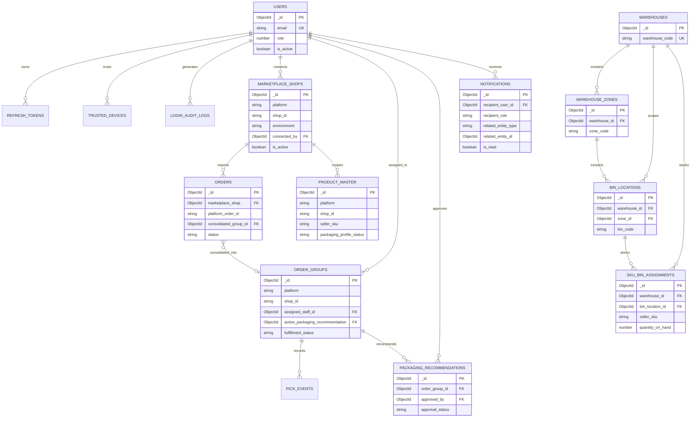

# OptiPackAI — ERD và data dictionary hiện trạng

> Mô hình dữ liệu thực tế của NestJS + MongoDB/Mongoose, đối chiếu từ `be/src/**/**.schema.ts`. Quan hệ ObjectId bên dưới là logical reference; MongoDB không enforce foreign key như SQL.

## 1. ERD tổng quan

## 2. Collection inventory

17 collection hiện có:

`users`, `refresh_tokens`, `trusted_devices`, `login_audit_logs`, `marketplace_shops`, `marketplace_oauth_states`, `orders`, `order_groups`, `pick_events`, `packaging_recommendations`, `product_master`, `warehouses`, `warehouse_zones`, `bin_locations`, `sku_bin_assignments`, `notifications`, `processed_webhook_events`.

### Quan hệ cần hiểu đúng

- `Order.shop_id` và `ProductMaster.shop_id` là string ID trên sàn; không phải ObjectId tới shop.
- `Order.marketplace_shop` là reference tới `marketplace_shops`.
- `Order` thuộc `OrderGroup` qua `consolidated_group_id`; group nhiều order không phải một order.
- `OrderGroup.active_packaging_recommendation` trỏ recommendation hiện hành; recommendation cũng giữ `order_group_id`.
- `Notification` nhận bởi `recipient_user_id` hoặc `recipient_role`; `related_entity_id` là polymorphic reference đi cùng `related_entity_type`.
- `processed_webhook_events` là hạ tầng chuẩn bị, chưa được consumer dùng trong flow hiện tại.

## 3. Data dictionary nghiệp vụ

Ký hiệu: `PK` document key, `FK` logical reference, `UK` unique, `?` optional, `null` nullable.

### `users`

| Attribute | Type | Required/default | Key/meaning |
|---|---|---|---|
| `_id` | ObjectId | ✓ | PK |
| `name`, `email` | string | ✓ | Email lowercase |
| `password` | string | ? | Internal password hash |
| `role` | number enum | ✓ | UserRole |
| `avatar` | string | default `''` | Public avatar URL |
| `login_type` | enum | ✓ | Local/Google |
| `must_change_password`, `is_active` | boolean | default true | Account state |
| `created_by` | ObjectId | ? | FK → users |
| `last_login_at`, `locked_until` | Date | ? | Login state |
| `failed_login_attempts` | number | default 0 | Brute-force counter |
| `mfa_secret` | string | ? | Internal MFA secret |
| `mfa_enabled` | boolean | default false | MFA state |
| `mfa_backup_codes` | string[] | default `[]` | Internal backup codes |
| `phone`, `address`, `employee_code`, `department` | string | ? | Profile/work data |
| `reset_password_token_hash` | string | ? | Internal reset hash |
| `reset_password_expires`, `must_change_password_by` | Date | ? | Password deadlines |
| `created_at`, `updated_at` | Date | auto | Timestamps |

Indexes: unique partial `email` khi `is_active=true`; unique partial `employee_code` nếu là string; `(role, is_active)`.

### `marketplace_shops`

| Attribute | Type | Required/default | Key/meaning |
|---|---|---|---|
| `_id` | ObjectId | ✓ | PK |
| `platform`, `shop_id`, `environment` | enum/string/enum | ✓ | Unique compound identity |
| `shop_name`, `shop_cipher` | string | null | Platform metadata |
| `access_token_encrypted`, `refresh_token_encrypted` | string | ✓ | `select:false`, encrypted internal |
| `access_token_expires_at`, `refresh_token_expires_at` | Date | ✓ | Token expiry |
| `last_polled_at` | Date | null | Polling checkpoint |
| `connected_by` | ObjectId | ✓ | FK → users |
| `is_active` | boolean | default true | Connection state |
| `created_at`, `updated_at` | Date | auto | Timestamps |

Unique index: `(platform, shop_id, environment)`; partial expiry index chỉ cho active shop.

### `orders`

| Attribute | Type | Required/default | Key/meaning |
|---|---|---|---|
| `_id` | ObjectId | ✓ | PK |
| `marketplace_shop` | ObjectId | ✓ | FK → marketplace_shops |
| `platform`, `shop_id`, `platform_order_id` | enum/string/string | ✓ | Source identity |
| `platform_order_number` | string | ? | Display number |
| `status` | enum | ✓ | Normalized order status |
| `raw_statuses` | string[] | default `[]` | Source statuses |
| `recipient` | embedded | ✓ | RecipientAddress |
| `consolidation_key` | string | ✓ | Consolidation lookup |
| `items` | embedded[] | default `[]` | Unit-level OrderItem |
| `total_amount`, `currency` | number/string | ✓, VND default | Money |
| `is_consolidated` | boolean | default false | Consolidation state |
| `consolidated_group_id` | ObjectId | null | FK → order_groups |
| `synced_at` | Date | ✓ | Last source sync |
| `is_active` | boolean | default true | Soft active |
| `created_at`, `updated_at` | Date | auto | Timestamps |

`RecipientAddress`: `full_name`, `phone`, `address_line1`, `city`, `country` required; `address_line2`, `postal_code` optional.

`OrderItem`: `platform_order_item_id`, `sku`, `name`, `quantity`, `unit_price`, `status` required; `variation` optional.

### `order_groups`

| Attribute | Type | Required/default | Key/meaning |
|---|---|---|---|
| `_id` | ObjectId | ✓ | PK |
| `platform`, `shop_id` | enum/string | ✓ | Group source |
| `order_count` | number | default 0 | Number of orders |
| `fulfillment_status` | enum | default awaiting packaging | Fulfillment state |
| `active_packaging_recommendation` | ObjectId | null | FK → packaging recommendations |
| `shop_name_snapshot` | string | ✓ | Denormalized display name |
| `assigned_staff_id` | ObjectId | null | FK → users |
| `assigned_at` | Date | null | Assignment time |
| `assignment_type` | enum/null | null | auto/manual |
| `order_priority` | enum | normal default | normal/express |
| `packaging_deadline` | Date | null | SLA deadline |
| `is_overdue` | boolean | false default | Deadline state |
| `created_at`, `updated_at` | Date | auto | Timestamps |
| `__v` | number | auto | API gọi là `version` |

### `packaging_recommendations`

| Attribute | Type | Required/default | Key/meaning |
|---|---|---|---|
| `_id` | ObjectId | ✓ | PK |
| `order_group_id` | ObjectId | ✓ | FK → order_groups |
| `box_size` | embedded | ✓ | length/width/height cm |
| `material_type`, `material_quantity` | string/number | ✓ | Packaging material |
| `estimated_shipping_cost_vnd`, `computation_time_ms` | number | ✓ | Computation result |
| `fallback_used` | boolean | false default | Fallback indicator |
| `approval_status` | enum | ✓ | Approval state |
| `approved_by` | ObjectId | null | FK → users |
| `approved_at` | Date | null | Approval time |
| `actual_measured_weight_kg` | number | null | Actual weight |
| `is_abnormal`, `is_active` | boolean | false/true default | Result state |
| `created_at`, `updated_at` | Date | auto | Timestamps |

`BoxSize`: `length_cm`, `width_cm`, `height_cm`.

### Warehouse collections

| Collection | Attributes |
|---|---|
| `warehouses` | `_id`; `warehouse_code` (unique); `warehouse_name`; `address`; `is_active` (default true); timestamps |
| `warehouse_zones` | `_id`; `warehouse_id` (FK/index → warehouses); `zone_code`; `zone_name`; `description` (default empty); timestamps |
| `bin_locations` | `_id`; `warehouse_id` (FK/index); `zone_id` (FK/index); `bin_code`; `aisle`; `rack`; `level`; timestamps |
| `sku_bin_assignments` | `_id`; `warehouse_id` (FK/index); `platform`; `shop_id`; `seller_sku`; `bin_location_id` (FK); `quantity_on_hand` (default 0, min 0); timestamps |

### `product_master`

`_id`; `platform`; `shop_id`; `seller_sku`; `dimension?`; `marketplace_dimension?`; `is_fragile?`; `packaging_profile_status` (needs_measurement/ready, default needs_measurement); `last_synced_at`; timestamps.

`PackageDimension` embedded gồm `package_length_cm`, `package_width_cm`, `package_height_cm`, `package_weight_kg`, optional và min `0.0001` nếu có.

### `pick_events`

`_id`; `order_group_id` (FK/index); `seller_sku`; `scanned_quantity`; `scan_method` (barcode/manual); `client_event_id` (nullable, idempotency); `remaining_stock_after`; `created_at`.

### `notifications`

`_id`; `recipient_user_id` (nullable/index); `recipient_role` (nullable/index); `type`; `severity` (info/warning/critical); `title`; `message`; `related_entity_type` (nullable); `related_entity_id` (nullable ObjectId); `is_read` (default false/index); `channels_sent` (default `[in_app]`); `created_at`.

## 4. Collection hạ tầng và TTL

| Collection | Attributes | Index/retention |
|---|---|---|
| `refresh_tokens` | `_id`, `token_hash`, `user_id`, `iat`, `exp`, `user_role`, `is_revoked`, `ip_address?`, `user_agent?`, timestamps | Unique token hash; user index; TTL `exp` |
| `trusted_devices` | `_id`, `user_id`, `token_hash`, `user_agent?`, `expires_at`, `created_at` | Unique token hash; user index; TTL `expires_at` |
| `login_audit_logs` | `_id`, `user_id?`, `email_attempted`, `success`, `failure_reason?`, `ip_address?`, `user_agent?`, `created_at` | `(user_id, created_at desc)`; TTL trên created_at |
| `marketplace_oauth_states` | `_id`, `state`, `admin_user_id`, `platform`, `created_at` | Unique state; TTL 600 giây |
| `processed_webhook_events` | `_id`, `platform`, `event_id`, `created_at` | Unique `(platform, event_id)`; TTL 7 ngày |

## 5. Ranh giới API/database

- API response không phải raw schema: controller mapper đổi tên field và loại bỏ Mongoose internals.
- `orders.items[]` lưu unit-level; aggregation theo SKU chỉ ở detail response.
- `order_groups.__v` được expose có chủ đích thành `version` cho optimistic concurrency.
- Token marketplace, password hash, MFA secret và token hash chỉ là internal data.
- `notifications.related_entity_id` là polymorphic link, luôn đọc cùng `related_entity_type`.
